# MySpringBoot

# 1.概述

## 1-1-spring boot概述

### spring的缺点：
* 1、配置繁琐
> 搭建ssm项目，需要配置大量xml。application.xml  spring-mybatis.xml  spring-mvc.xml
> 大量的bean。
* 2、依赖繁琐
> pom.xml要写大量依赖。pom.xml spring-core  spring-bean  spring-mvc  spring-mybatis
> 版本冲突spring-core 4.0 spring-mvc 5.0

### springboot概念
springboot提供了一种快速使用spring的方式，基于**约定优与配置**的思想，可以让开发人员不必在配置上
与逻辑业务之间进行思维的切换，全身心的投入到逻辑业务的代码编写中，从而大大提高了开发的效率。
这是官网地址[springboot](https://spring.io/projects/spring-boot)
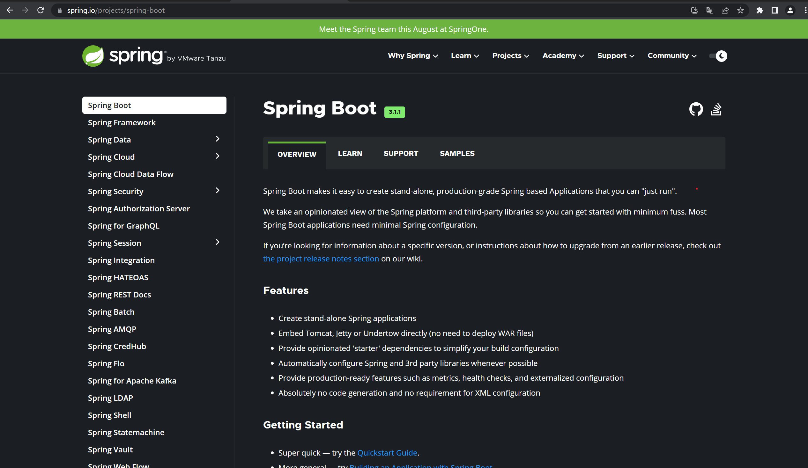

### springboot功能
* 1、自动配置   
springboot的自动配置是一个允许时（更准确地说，是应用程序启动时）的过程，考虑了众多因数，才决定
spring配置应该用哪个，不该用哪个。该过程是springboot自动完成的

* 2、起步依赖   
起步依赖本质上是一个Maven项目对象模型（Project Object Model POM），定义了对其他库的
**传递依赖**，这些东西加在一起即支持某项功能。**依赖太多**，**版本冲突**。

简单的说，起步依赖就是将具备某种功能的坐标打包到一起，并提供一些默认的功能。
* 3、辅助功能    
提供了一些大项目中常见的非功能性特性：如嵌入式服务器（tomcat）、安全、指标、健康检测、外部配置等。

**注意：SpringBoot并不是对Spring功能上的增强，而是提供了一种快速使用Spring的方式。**

## 1-2-springboot快速入门
官网：https://spring.io/projects/spring-boot
1、完成搭建springboot工程，定义HellController.hello()方法，返回“Hello SpringBoot”。

2、实现步骤：

1: 创建Maven项目springboot-hello    
2：导入springboot起步依赖      
```xml
<!--springboot工程需要继承的父工程-->
    <parent>
        <groupId>org.springframework.boot</groupId>
        <artifactId>spring-boot-starter-parent</artifactId>
        <version>3.0.6</version>
        <relativePath/> <!-- lookup parent from repository -->
    </parent>

    <dependencies>
        <!--web开发的起步依赖-->
        <dependency>
            <groupId>org.springframework.boot</groupId>
            <artifactId>spring-boot-starter-web</artifactId>
        </dependency>
    </dependencies>
```
3、定义主启动类
```java
package com.hello;

import org.springframework.boot.SpringApplication;
import org.springframework.boot.autoconfigure.SpringBootApplication;

@SpringBootApplication // 表示这个类是springboot主启动类
public class HelloApplication {
    public static void main(String[] args) {
        SpringApplication.run(HelloApplication.class, args);
    }
}
```

4、编写HelloController
```java
package com.hello.controller;

import org.springframework.web.bind.annotation.GetMapping;
import org.springframework.web.bind.annotation.RequestMapping;
import org.springframework.web.bind.annotation.RestController;

@RestController
@RequestMapping("/hello")
public class HelloController {

    @GetMapping("/test")
    public String test() {
        return "Hello SpringBoot";
    }
}
```

5、启动测试

看到Started项目启动成功，打开浏览器输入127.0.0.1:8080/hello/test看到
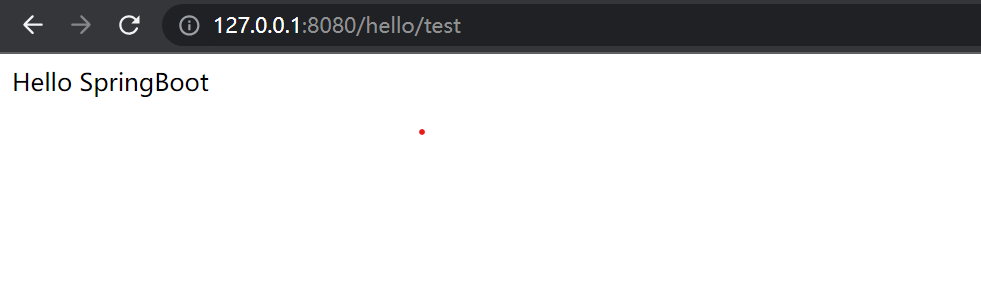

### 总结
启动springboot一个web工程：    
1、pom规定父工程，导入web的起步依赖   
2、主启动类@SpringBootApplication、main   
3、业务逻辑controller、service、dao
* springboot在创建项目时，使用jar的打包方式。 java-jar xxx.jar
* springboot的引导类，是项目入口，运行main方法就可以启动项目。
* 使用springboot和spring构建的项目，业务代码编写方式完全一样。

## 1-3-快速构建spring boot工厂

使用Spring Initializr快速构建springboot项目     

步骤如下：
先选择你的Java版本号，项目名称等等
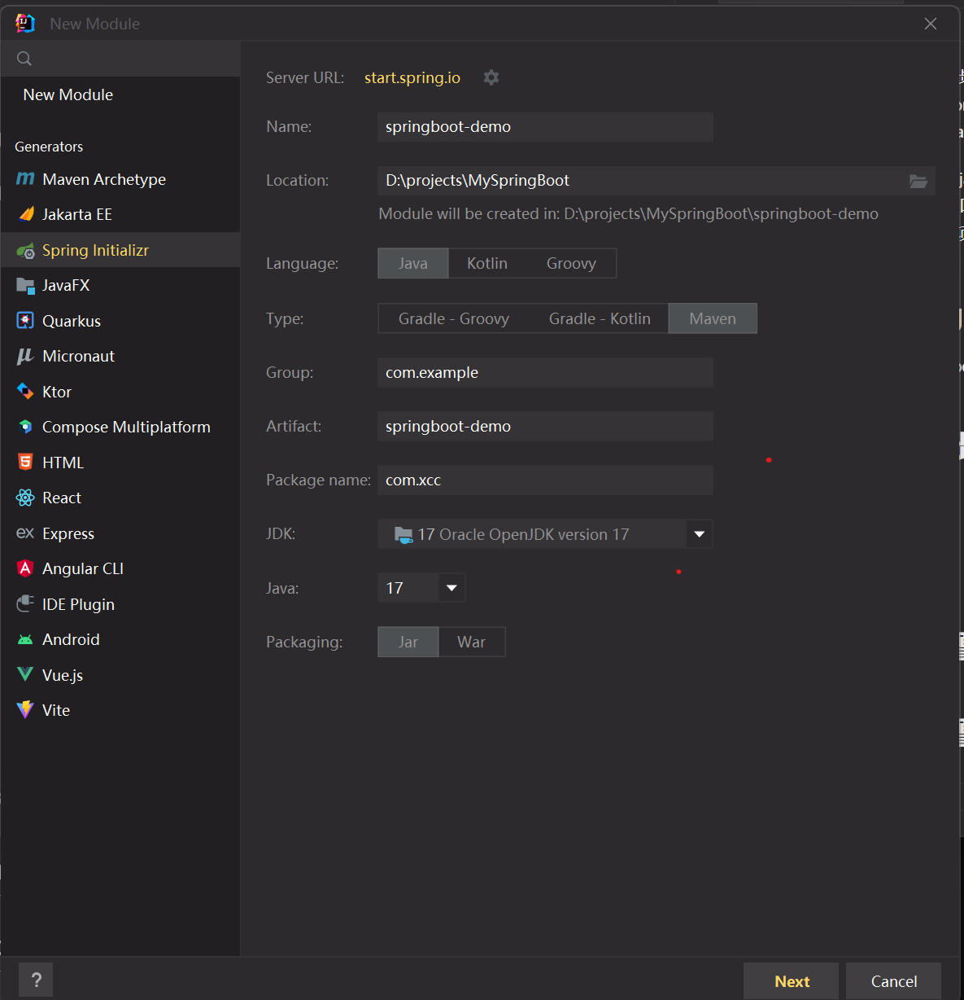
在选择依赖

接下来idea会自己下载依赖，下载完成可以看到，这边自动帮你创建好了主启动类
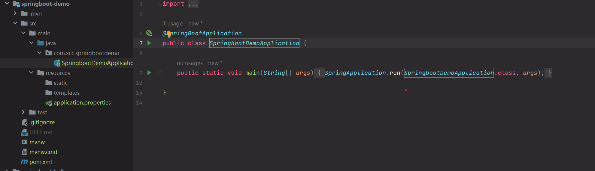
编写controller
```java
@RestController
public class HelloController {

    @GetMapping("/hello")
    public String test() {
        return "Hello SpringBoot";
    }
}
```
启动测试，访问：http://127.0.0.1:8080/hello

## 1-4-spring boot起步依赖原理分析

我们在pom文件中按ctrl点击**spring-boot-starter-parent**
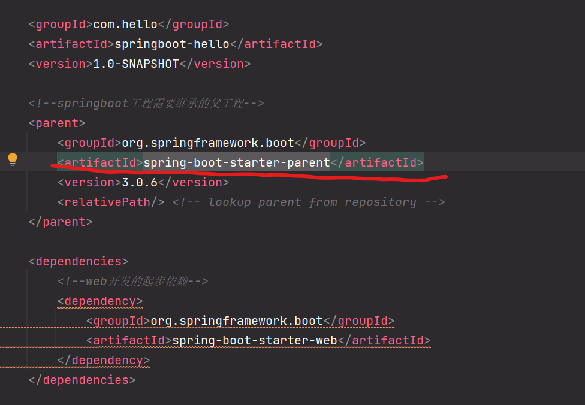
然后看到里面有个
```xml
<parent>
    <groupId>org.springframework.boot</groupId>
    <artifactId>spring-boot-dependencies</artifactId>
    <version>3.0.6</version>
  </parent>
```
再按上面的操作点**spring-boot-dependencies**
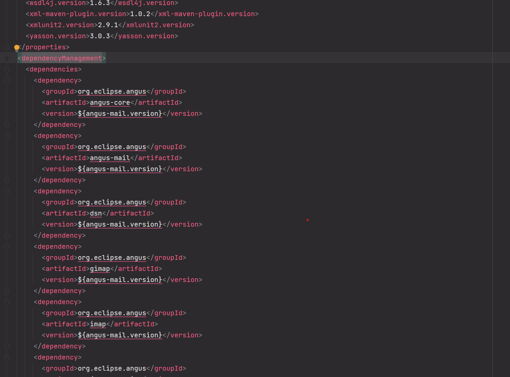
看到有个**dependencyManagement**这边规定好了要引入什么依赖

同理再看看**spring-boot-starter-web**

里面已经帮我们规定好了用**spring-web**什么版本，这也就是为什么我们没有引入tomcat，却能用的原因

总结：
* 在spring-boot-start-parent中定义了各种技术的版本信息，组合了一套最优搭配的技术版本。
* 在各种starter中，定义了完成该功能需要的坐标集合，其中大部分版本信息来自与父工程。
* 我们的工程继承parent，引入starter后，通过**依赖传递**，就可以简单获得需要的jar包，并且不会存在版本冲突等问题。

# 2.配置文件

## 2-1-spring boot配置文件-配置文件分类
springboot是基于约定的，所以很多都有默认值，但如果想使用总结的配置替换默认配置的话，就
可以使用application.properties或者application.yml(application.yaml)进行配置。

1.默认配置文件名称：application      
2.再同一级目录下有限集为properties > yml > yaml        
例如：配置内置tomcat的端口        
properties：
```xml
server.port=8080
```
yml:
```java
server:
    port: 8080
```
init工程：     
修改application.properties
```java
server.port=2023
```
新建application.yml
```java
server:
    port: 8088
```
启动测试：

可以看到最后显示的端口是2023properties中配置的结果

## 2-2-spring boot配置文件-yml基本语法

### 1、概念：
yml是一种直观的能够被电脑识别的数据数据序列化格式，并且容易被人类阅读，容易和脚本语言交互的，
可以被支持YML库的不同编程语言程序导入。       

### 2、语法特点：
* 大小写敏感
* 数据值前边必须有空格，作为分隔符
* 使用缩进表示层级关系
* 缩进时不允许使用Tab键，只允许使用空格（各个系统Tab对应的空格数目可能不同，导致层次混乱）
* 缩进的空格数目不重要，只要相同层级的元素左侧对齐即可
* ‘#’表示注释，从这个字符一直到行尾，都会被解析器忽略
```yaml
server:
  port: 2024
  address: 127.0.0.1
name: xcc
```

## 2-3-spring boot配置文件-yml数据格式
**对象(map)**：键值对的集合：
```yaml
person1:
  name: hello
# 行内写法
person2： {name: world}
```
**数组**：一组按次序排列的值
```yaml
arry1:
  - springboot
  - springcloud
# 行内写法：
array2: [vue, react]
```
**纯量**：单个的、不可再分的值
```yaml
msg1: 'hello \n world'    # 单引号忽略转义字符
msg2: "Hi \n springboot"  # 双引号识别转义符号
```
**参数引用**
```yaml
xcc: linux
person:
  name: ${xcc}            # 引用上边定义的xcc值
```

## 2-4-spring boot配置文件-获取数据

### 1、@value
```java
    // 获取普通配置
    @Value("${name}")
    private String name;

    // 获取对象属性
    @Value("${person1.name}")
    private String name1;

    // 获取数组
    @Value("${array2[0]}")
    private String array1;

    // 获取纯量
    @Value("${msg1}")
    private String msg1;
```
### 2、Environment
```java
    @Autowired
    private Environment env;
    System.out.println("name1====="+env.getProperty("person1.name"));
    System.out.println("array1====="+env.getProperty("array2[0]"));
    System.out.println("msg1====="+env.getProperty("msg1"));
    System.out.println("name====="+env.getProperty("name"));
```

### 3、@ConfigurationProperties
**注意**：prefix一定要写
创建一个实体类Person
```java
package com.hello.entity;

import org.springframework.boot.context.properties.ConfigurationProperties;
import org.springframework.stereotype.Component;

import java.util.Arrays;

@Component
@ConfigurationProperties(prefix = "person")
public class Person {
    private String name;
    private int age;
    private String[] address;

    @Override
    public String toString() {
        return "Person{" +
                "name='" + name + '\'' +
                ", age=" + age +
                ", address=" + Arrays.toString(address) +
                '}';
    }

    public String getName() {
        return name;
    }

    public void setName(String name) {
        this.name = name;
    }

    public int getAge() {
        return age;
    }

    public void setAge(int age) {
        this.age = age;
    }

    public String[] getAddress() {
        return address;
    }

    public void setAddress(String[] address) {
        this.address = address;
    }
}
```
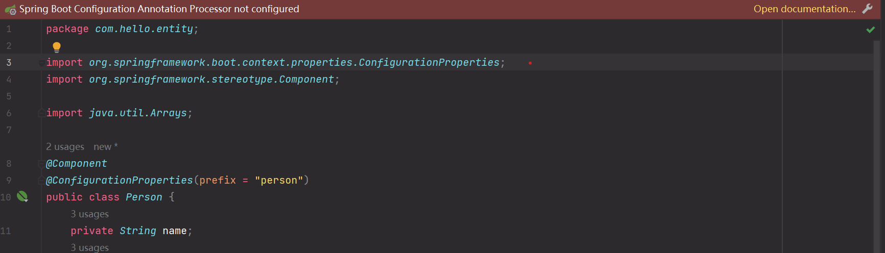
出现在这个不用慌。
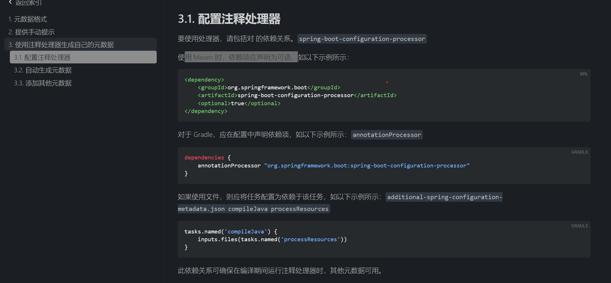
要使用处理器，要有这个依赖。spring-boot-configuration-processor
再maven上加上依赖就好了
```xml
        <dependency>
            <groupId>org.springframework.boot</groupId>
            <artifactId>spring-boot-configuration-processor</artifactId>
            <optional>true</optional>
        </dependency>
```
HelloController类
```java
    @Autowired
    Person person;
    
    System.out.println(person.toString());
```

## 2-5-spring boot配置文件-profile-运维

### 1、背景：profile是用来完成不同环境下，配置动态切换功能的

### 2、profile配置方式
多profile文件方式：提供多个配置文件，每个代表一种环境。主配置文件application.properties配置：
> spring.profile.active=dev
* application-dev.properties/yml  开发环境
* application-test.properties/yml 测试环境
* application-pro.properties/yml  生产环境
 
yml多文档方式：       
再yml中使用  --- 分隔不同配置
```yaml
---
server:
  port: 8081
spring:
  profiles: dev
---
server:
  port: 8082
spring:
  profiles: test
---
server:
  port: 8083
spring:
  profiles: pro
---
spring:
  profiles:
    active: pro
```

**开发时候主要用这种方式**：多profile文件方式

### 3、profile激活方式
* 配置文件：再配置文件种配置：spring.profiles.active=dev
* 虚拟机参数：再VM options指定：-Dspring.profiles.active=pro
* 命令行参数：--spring.profiles.active=test

相当于上线时，运行jar包：java -jar xxx.jar --spring.profiles.active=pro        
测试：使用maven打包此项目，再target包种出现xxx.jar      
cmd 输入
```java
java -jar xxx.jar --spring.profiles.active=pro
```

## 2-6-spring boot配置文件-项目内部配置文件加载顺序

加载顺序为下文的排序顺序，高优先级配置的属性会生效
* file:./config/: 当前项目下的/config目录下
* file:./ : 当前项目的根目录
* classpath:/config/: classpath的/config目录
* classpath:/ : classpath的根目录

### 测试：
新建springboot-config目录，分别再以上目录创建配置文件。    
注意：
1、项目根目录为springboot-test。  
2、高级配置文件只覆盖低级配置文件的重复项。低级配置文件的独有项任然有效。最低级配置文件中添加：    
> server.servlet.context-path = /test

访问：http://127.0.0.1:8084/test/hello

## 2-7-spring boot配置文件-项目外部配置文件加载顺序

外部配置文件的使用是为了不修改配置文件做的       
### 1、命令行
> java -jar xxx.jar --name="Spring" --server.port=8008

### 2、指定配置文件位置
> java -jar xxx.jar --spring.config.location=d://application.properties

### 3、其他
https://docs.spring.io/spring-boot/docs/current/reference/html/features.html#features.external-config

作用：生产环境，随时改变环境变量时，可以通过改变配置文件来做。不需要重新打包项目。

# 3.整合框架

## 3-1-springboot整合junit

1、搭建springboot工程springboot-test。不引入依赖

2、引入start-test起步依赖
```xml
    <dependencies>
        <dependency>
            <groupId>org.springframework.boot</groupId>
            <artifactId>spring-boot-starter-web</artifactId>
        </dependency>

        <dependency>
            <groupId>org.springframework.boot</groupId>
            <artifactId>spring-boot-starter-test</artifactId>
            <scope>test</scope>
        </dependency>
    </dependencies>
```
3、编写UserService
```java
package com.xcc.service;

import org.springframework.stereotype.Service;

@Service
public class UserService {
    public void add() {
        System.out.println("Hello SpringBoot!");
    }
}
```
4、编写测试类UserServiceTest
```java
package com.xcc;

import com.xcc.service.UserService;
import org.junit.jupiter.api.Test;
import org.springframework.beans.factory.annotation.Autowired;
import org.springframework.boot.test.context.SpringBootTest;

@SpringBootTest(classes = SpringbootTestApplication.class) // 这是springboot测试类，容器就起来了
public class UserServiceTest {

    @Autowired
    private UserService userService;

    @Test
    public void test() {
        userService.add();
    }

}
```

## 3-2-springboot整合mybatis

1、搭建springboot工程springboot-mybatis

2、引入mybatis起步依赖，添加mysql驱动
```xml
    <dependencies>
        <dependency>
            <groupId>org.springframework.boot</groupId>
            <artifactId>spring-boot-starter-web</artifactId>
        </dependency>

        <dependency>
            <groupId>org.springframework.boot</groupId>
            <artifactId>spring-boot-starter-test</artifactId>
            <scope>test</scope>
        </dependency>

        <!-- https://mvnrepository.com/artifact/org.mybatis.spring.boot/mybatis-spring-boot-starter -->
        <dependency>
            <groupId>org.mybatis.spring.boot</groupId>
            <artifactId>mybatis-spring-boot-starter</artifactId>
            <version>2.3.0</version>
        </dependency>

        <!-- https://mvnrepository.com/artifact/mysql/mysql-connector-java -->
        <dependency>
            <groupId>mysql</groupId>
            <artifactId>mysql-connector-java</artifactId>
            <version>5.1.4</version>
        </dependency>
    </dependencies>
```
3、数据库创建张表
```mysql
CREATE TABLE `person` (
  `id` bigint(20) NOT NULL AUTO_INCREMENT COMMENT '主键id',
  `name` varchar(255) DEFAULT NULL COMMENT '姓名',
  `age` int(11) DEFAULT NULL COMMENT '年龄',
  PRIMARY KEY (`id`)
) ENGINE=InnoDB DEFAULT CHARSET=utf8;
```
4、配置文件
```yaml
spring:
  datasource:
    #?serverTimezone=UTC解决时区的报错
    url: jdbc:mysql://localhost:3306/mysql_demo?serverTimezone=UTC&useUnicode=true&characterEncoding=utf-8
    driver-class-name: com.mysql.jdbc.Driver
    username: root
    password: root
mybatis:
  mapper-locations: classpath:mapper/*
```
5、实体类
```java
package com.xcc.springbootmybatis.entity;

public class Person {
    private Long id;
    private String name;
    private int age;

    public Person() {}

    public Person(Long id, String name, int age) {
        this.id = id;
        this.name = name;
        this.age = age;
    }

    @Override
    public String toString() {
        return "Person{" +
                "id=" + id +
                ", name='" + name + '\'' +
                ", age=" + age +
                '}';
    }

    public Long getId() {
        return id;
    }

    public void setId(Long id) {
        this.id = id;
    }

    public String getName() {
        return name;
    }

    public void setName(String name) {
        this.name = name;
    }

    public int getAge() {
        return age;
    }

    public void setAge(int age) {
        this.age = age;
    }
}
```
6、DAO接口
注解方式的
```java
package com.xcc.springbootmybatis.mapper;

import com.xcc.springbootmybatis.entity.Person;
import org.apache.ibatis.annotations.Mapper;
import org.apache.ibatis.annotations.Select;

import java.util.List;

@Mapper
public interface PersonMapper {
    @Select("select * from Person")
    List<Person> list();
}
```
使用XML方式的
```java
package com.xcc.springbootmybatis.mapper;

import com.xcc.springbootmybatis.entity.Person;
import org.apache.ibatis.annotations.Mapper;

import java.util.List;

@Mapper
public interface PersonXMLMapper {
    List<Person> list();
}

```
7、xml文件
```xml
<?xml version="1.0" encoding="UTF-8" ?>
<!DOCTYPE mapper
        PUBLIC "-//mybatis.org//DTD Mapper 3.0//EN"
        "http://mybatis.org/dtd/mybatis-3-mapper.dtd">
<mapper namespace="com.xcc.springbootmybatis.mapper.PersonXMLMapper">

    <select id="list" resultType="com.xcc.springbootmybatis.entity.Person">
        select * from Person
    </select>
</mapper>
```
8、测试
```java
package com.xcc.springbootmybatis;

import com.xcc.springbootmybatis.entity.Person;
import com.xcc.springbootmybatis.mapper.PersonMapper;
import com.xcc.springbootmybatis.mapper.PersonXMLMapper;
import org.junit.jupiter.api.Test;
import org.springframework.beans.factory.annotation.Autowired;
import org.springframework.boot.test.context.SpringBootTest;

import java.util.List;

@SpringBootTest
public class PersonTest {

    @Autowired
    private PersonMapper personMapper;

    @Autowired
    private PersonXMLMapper personXMLMapper;

    @Test
    public void test() {
        List<Person> list = personMapper.list();
        System.out.println(list);
    }

    @Test
    public void demo() {
        List<Person> list = personXMLMapper.list();
        System.out.println(list);
    }

}
```
## 3-3-springboot整合redis

1、搭建springboot工程springboot-redis

2、引入redis依赖     
如果不知道怎么找依赖的话，直接再这个官网 https://mvnrepository.com/ 上搜索
```xml
<dependencies>
        <dependency>
            <groupId>org.springframework.boot</groupId>
            <artifactId>spring-boot-starter-web</artifactId>
        </dependency>

        <dependency>
            <groupId>org.springframework.boot</groupId>
            <artifactId>spring-boot-starter-test</artifactId>
            <scope>test</scope>
        </dependency>

        <!-- https://mvnrepository.com/artifact/org.springframework.boot/spring-boot-starter-data-redis -->
        <dependency>
            <groupId>org.springframework.boot</groupId>
            <artifactId>spring-boot-starter-data-redis</artifactId>
            <version>3.1.0</version>
        </dependency>
    </dependencies>
```
3、修改配置文件
```yaml
spring:
  redis:
    host: 127.0.0.1
    prot: 6379
```
4、编写测试类
```java
package com.xcc.springbootredis;

import org.junit.jupiter.api.Test;
import org.springframework.beans.factory.annotation.Autowired;
import org.springframework.boot.test.context.SpringBootTest;
import org.springframework.data.redis.core.RedisTemplate;

@SpringBootTest
public class RedisTest {

    @Autowired
    RedisTemplate redisTemplate;

    @Test
    public void test1() {
        redisTemplate.opsForValue().set("a","Hello");

        redisTemplate.boundValueOps("b").set("Redis");
    }

    @Test
    public void test2() {
        Object c = redisTemplate.opsForValue().get("a");
        System.out.println(c);
        Object d = redisTemplate.boundValueOps("b").get();
        System.out.println(d);
    }
}
```

## 4、springboot自动配置

### Condition
Condition是spring4.0后引入的条件配置接口，通过实现Condition接口可以完成有条件的加载相应的Bean      
@Condition要配和Condition的实现类(ClassCondition)进行使用  
1、创建模块springboot-condition

2、观察spring在自动创建bean过程   
改造启动类
```java
@SpringBootApplication
public class SpringbootConditionApplication {

    public static void main(String[] args) {
        // 返回spring容器
        ConfigurableApplicationContext context = SpringApplication.run(SpringbootConditionApplication.class, args);

        // 获取redisTemplate这个bean对象
        Object redisTemplate = context.getBean("redisTemplate");
        System.out.println(redisTemplate);

    }

}
```
启动：获取不到对象

加上redis的依赖
```xml
<!-- https://mvnrepository.com/artifact/org.springframework.boot/spring-boot-starter-data-redis -->
        <dependency>
            <groupId>org.springframework.boot</groupId>
            <artifactId>spring-boot-starter-data-redis</artifactId>
            <version>3.1.0</version>
        </dependency>
```
可以看到

只要引入依赖，就可以再spring的容器中获取对象

创建一个实体类
```java
package com.xcc.springbootcondition.domain;

public class User {
}
```
再创建一个配置类
```java
package com.xcc.springbootcondition.config;

import com.xcc.springbootcondition.domain.User;
import org.springframework.context.annotation.Bean;
import org.springframework.context.annotation.Configuration;

// 配置类
@Configuration
public class UserConfig {

    @Bean
    public User user() {
        return new User();
    }
}
```
验证
```java
@SpringBootApplication
public class SpringbootConditionApplication {
    public static void main(String[] args) {
        // 返回spring容器
        ConfigurableApplicationContext context = SpringApplication.run(SpringbootConditionApplication.class, args);

        // 获取redisTemplate这个bean对象
//        Object redisTemplate = context.getBean("redisTemplate");
//        System.out.println(redisTemplate);

        // 通过名字拿bean对象
//        User user = (User) context.getBean("user");
//        System.out.println(user);

        // 通过类型拿bean对象
        User user = (User) context.getBean(User.class);
        System.out.println(user);
    }
}
```
刚才我们写了一个配置类UserConfig，当我们启动springboot的时候会自动帮我们创建User对象。     

但一般启动项目的时候就要创建某个对象，都要有个前置条件     
举个例子：你的配置文件中要有下面这个；才能创建User对象
```yaml
ipAddress: localhost
```
可以利用springboot的

改造配置类UserConfig
```java
    @Bean
    @ConditionalOnProperty(name = "ipAddress", havingValue="localhost")
    public User user2() {
        return new User();
    }
```
主启动类打印
```java
ConfigurableApplicationContext context = SpringApplication.run(SpringbootConditionApplication.class, args);
User user2 = (User) context.getBean("user2");
System.out.println(user2);
```
然后启动就可以看到
> com.xcc.springbootcondition.domain.User@4af7dd6a

这是springboot自带的，我们也可以根据源码自己写个自己的    

先看一下这边有很多个注解ConditionalOnBean,ConditionalOnClass等等。点进去看看
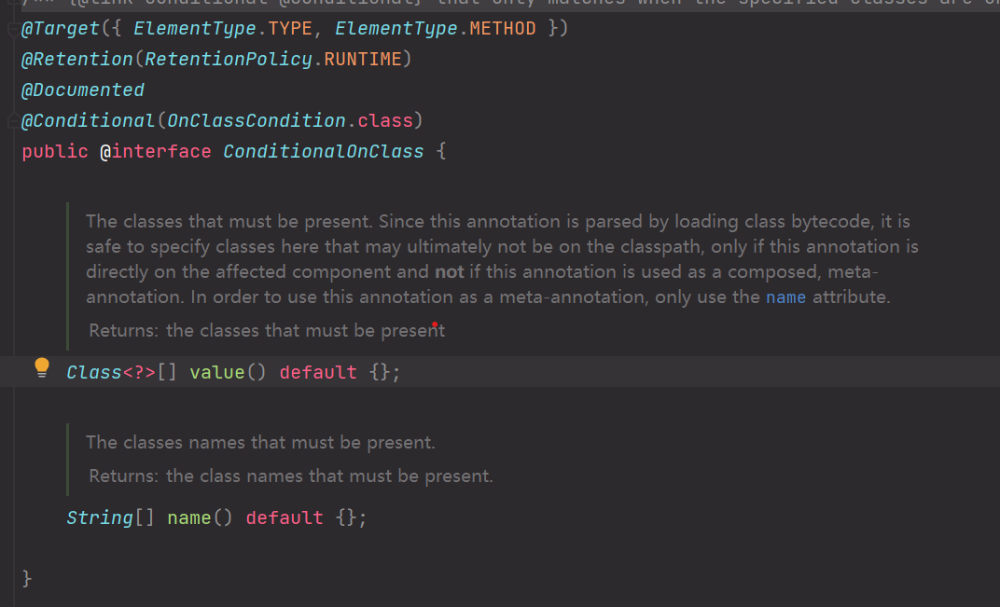
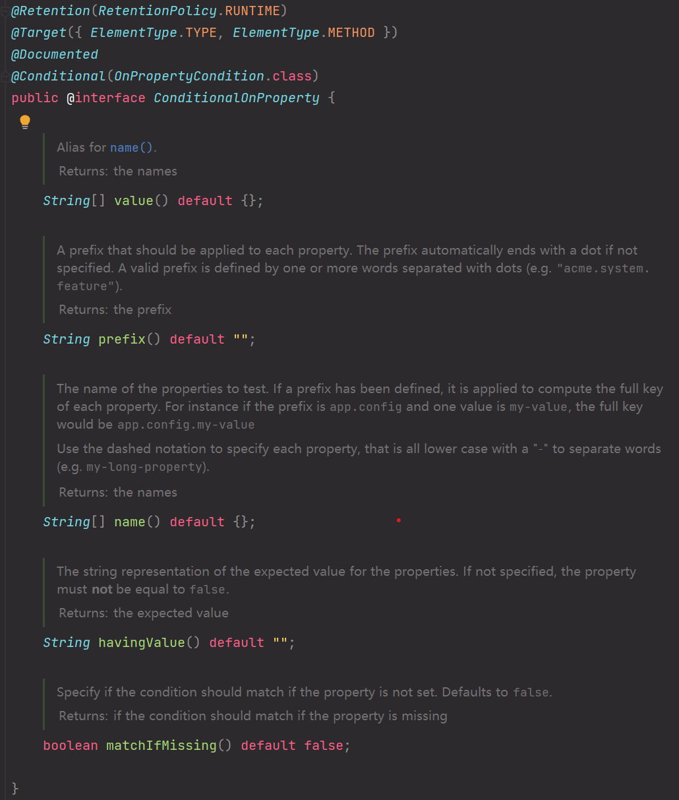
我们可以看到这些注解都是有3个注解，Target，Retention，Documented   
看看官网：https://docs.spring.io/spring-boot/docs/current/reference/html/features.html#features.developing-auto-configuration
* Target : 可以用在哪些地方
* Retention : 什么时候起作用
* Documented : 生成javadoc

我们也按葫芦画瓢；写这个自己的注解
创建自己的ConditionalOnClass注解
```java
package com.xcc.springbootcondition.condition;

import org.springframework.context.annotation.Conditional;

import java.lang.annotation.*;

@Target({ElementType.TYPE, ElementType.METHOD})            
@Retention(RetentionPolicy.RUNTIME)                         
@Documented
public @interface ConditionalOnClass {
}
```
光有这些还不够，还要加上@Conditional,要有对应的类OnClassCondition，OnBeanCondition等等
```java
@Conditional(ClassCondition.class)
```
这里我们建个ClassCondition类
```java
public class ClassCondition{
}
```
然后我们在看看源码**Conditional**干了什么事的

> Class<? extends Condition>[] value();

这注解要继承一个**Condition**在改造一下我们创建的ClassCondition类
```java
public class ClassCondition implements Condition {
    @Override
    public boolean matches(ConditionContext context, AnnotatedTypeMetadata metadata) {
        return false;
    }
}
```
分析：     
我们建了一个类然后继承了ClassCondition类，还实现了matches这个方法，这个方法返回一个boolean。    
就是说这边是可以加上我们自己写的逻辑，然后判断返回一个boolean从而决定某个bean对象是否生成。     
我们的自己的注解在加上要传的参数就好了
```java
@Target({ElementType.TYPE, ElementType.METHOD})             
@Retention(RetentionPolicy.RUNTIME)                         
@Documented                                                 
@Conditional(ClassCondition.class)
public @interface ConditionalOnClass {
    String[] value();       // 注解参数
}
```
然后就是ClassCondition类添加逻辑
```java
public class ClassCondition implements Condition {
    @Override
    public boolean matches(ConditionContext context, AnnotatedTypeMetadata metadata) {
        try {
            Map<String, Object> map = metadata.getAnnotationAttributes("com.xcc.springbootcondition.condition.ConditionalOnClass");
            System.out.println(map);

            String [] values = (String[]) map.get("value");
            for (String value : values) {
                Class.forName(value);
            }
            return true;
        } catch (Exception e) {
            return false;
        }
    }
}
```
配置类UserConfig
```java
@Configuration
public class UserConfig {
    @Bean
    @ConditionalOnClass({"redis.clients.jedis.Jedis"})
    public User user() {
        return new User();
    }
}
```
### 切换内置web服务器
我们创建springboot工程的时候引入了web，在启动的报文里会看到：
> o.s.b.w.embedded.tomcat.TomcatWebServer  : Tomcat initialized with port(s): 8080 (http)

springboot默认了端口和tomcat。我们的springboot需要引入spring-boot-starter-web，    
我们就看看spring-boot-starter-web的里面：

里面引了tomcat，在点进去
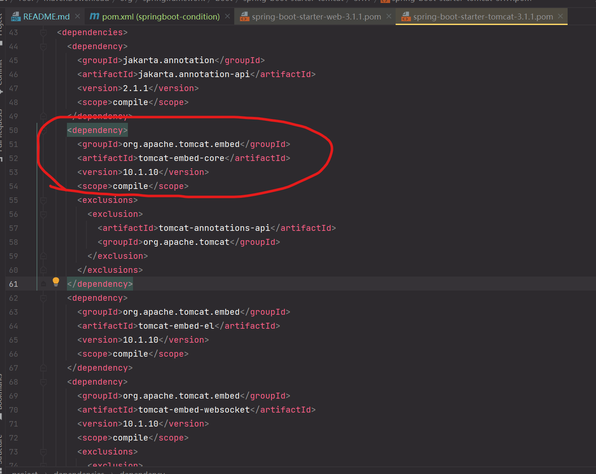
这边已经引入的tomcat。
在看看springboot的配置
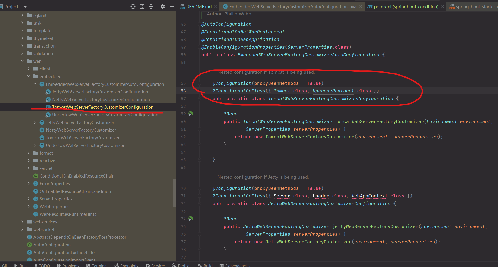
这边EmbeddedWebServerFactoryCustomizerAutoConfiguration就是个配置里面看到了@ConditionalOnClass({ Tomcat.class, UpgradeProtocol.class })
这个就是查项目有没有引入tomcat的，和刚才我们自己写的注解一样的道理。

为什么springboot启动是默认用tomcat了，因为引入的依赖spring-boot-starter-web中就有tomcat，
而spring-boot-autoconfigure中又检查项目有没有引入tomcat，引入就创建相应的bean

要是想不用tomcat使用别的容器修改pom文件就好
```xml
        <dependency>
            <groupId>org.springframework.boot</groupId>
            <artifactId>spring-boot-starter-web</artifactId>
            <exclusions>
                <exclusion>
                    <groupId>org.springframework.boot</groupId>
                    <artifactId>spring-boot-starter-tomcat</artifactId>
                </exclusion>
            </exclusions>
        </dependency>

        <!-- https://mvnrepository.com/artifact/org.springframework.boot/spring-boot-starter-jetty -->
        <dependency>
            <groupId>org.springframework.boot</groupId>
            <artifactId>spring-boot-starter-jetty</artifactId>
            <version>2.7.8</version>
        </dependency>
```
在启动的报文中可以看见：
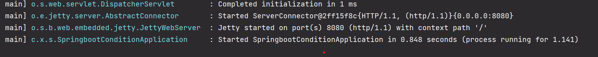

springboot工程，只要你引入了web依赖，就会自动加载spring-boot-autoconfigure。
autoconfig工程里都有常用的配置类，只要工程中，引入了相关起步依赖，这些对象我们本项目的容器中就有了。

### Enable
springboot虽然准备了很多常用的配置类，但是一般我们在实际开发中会引用别的类像：阿里云，七牛云等等；      
举个例子：我们创建两个springboot工程，springboot-enable，springboot-enable-other
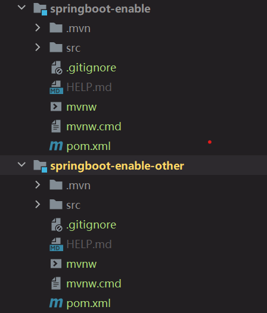
在springboot-enable-other中加个Person类
```java
package com.xcc.springbootenableother.demain;

public class Person {
}
```
再来个配置类PersonConfig
```java
package com.xcc.springbootenableother.config;

import com.xcc.springbootenableother.demain.Person;
import org.springframework.context.annotation.Bean;
import org.springframework.context.annotation.Configuration;

// 配置类注解
@Configuration
public class PersonConfig {

    @Bean
    public Person person() {
        return new Person();
    }
}
```
启动的时候bean中就会有Person这个对象。然后再springboot-enable的pom加上springboot-enable-other
```xml
        <dependency>
            <groupId>com.xcc</groupId>
            <artifactId>springboot-enable-other</artifactId>
            <version>0.0.1-SNAPSHOT</version>
        </dependency>
```
springboot-enable-other的主启动类改一下
```java
@SpringBootApplication
public class SpringbootEnableApplication {
    public static void main(String[] args) {
        ConfigurableApplicationContext context = SpringApplication.run(SpringbootEnableApplication.class, args);

        Person perosn = (Person) context.getBean("person");
        System.out.println(perosn);
    }
}
```
启动

可以看到No bean named 'person' available。容器中没有person这个对象。    
springboot不能直接获取在其他工程中定义的Bean

主要是这三个注解，上面那几个是元注解
* SpringBootConfiguration   // 自动配置相关
* EnableAutoConfiguration   // 扫描应用程序中的所有组件，自动配置Spring需要的组件
* ComponentScan             // 扫本包及子包，根据扫描的规则找出哪些需要自动装配到spring的bean容器中

分析：之前的redis我们只要在pom文件那边引入依赖就可以在容器中获取了，是因为springboot常用的配置中就有的。系统启动才能在容器中获取。
而刚才这个只是引入了，相应的配置类并没有，在springboot-enable中没，在根据上面的3个注解，其实就是缺配置。加配置也3种方法：

1、扫描第三方jar包的配置类。
```java
@ComponentScan("com.xcc.springbootenableother.config")
@SpringBootApplication
public class SpringbootEnableApplication {

    public static void main(String[] args) {
        ConfigurableApplicationContext context = SpringApplication.run(SpringbootEnableApplication.class, args);

        Person perosn = (Person) context.getBean("person");
        System.out.println(perosn);
    }

}
```
2、把第三方配置类引进来。
```java
@Import(PersonConfig.class)
@SpringBootApplication
public class SpringbootEnableApplication {

    public static void main(String[] args) {
        ConfigurableApplicationContext context = SpringApplication.run(SpringbootEnableApplication.class, args);

        Person perosn = (Person) context.getBean("person");
        System.out.println(perosn);
    }

}
```
3、第三方注解封装好。     
springboot-enable-other添加个注解类
```java
package com.xcc.springbootenableother.config;

import org.springframework.context.annotation.Import;

import java.lang.annotation.*;

@Target(ElementType.TYPE)
@Retention(RetentionPolicy.RUNTIME)
@Documented
@Inherited
@Import(PersonConfig.class)
public @interface EnablePerson {
}
```
springboot-enable的主启动类加上写好的注解类@EnablePerson
```java
@EnablePerson
@SpringBootApplication
public class SpringbootEnableApplication {

    public static void main(String[] args) {
        ConfigurableApplicationContext context = SpringApplication.run(SpringbootEnableApplication.class, args);

        Person perosn = (Person) context.getBean("person");
        System.out.println(perosn);
    }

}
```
一般开发的时候用第三种方法，前面两个太麻烦了：一个你要知道配置类的全限名，一个你要知道配置类是啥

## 5、springboot自定义starter

## 6、springboot事件监听

## 7、springboot流程分析

## 8、springboot监控

## 9、springboot部署
springboot的部署：
* 打成jar包
* 打成war包

### jar包方式
打开idea的maven这边，点击package

在target这边会有个jar包

不过你要是嫌名字太上可以再pom文件中起别名
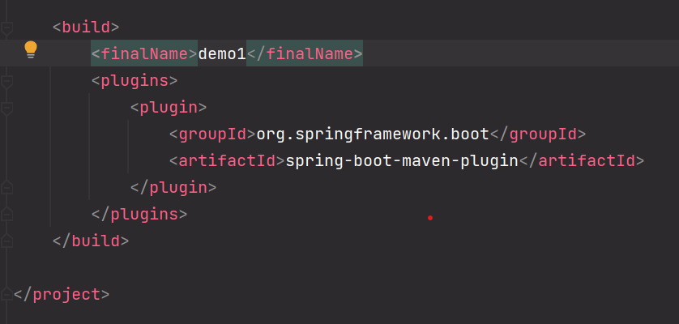
还是打开idea的maven这边先clean清理一下，再package打包

target这边生成的jar包就是你再pom文件中起的名字了
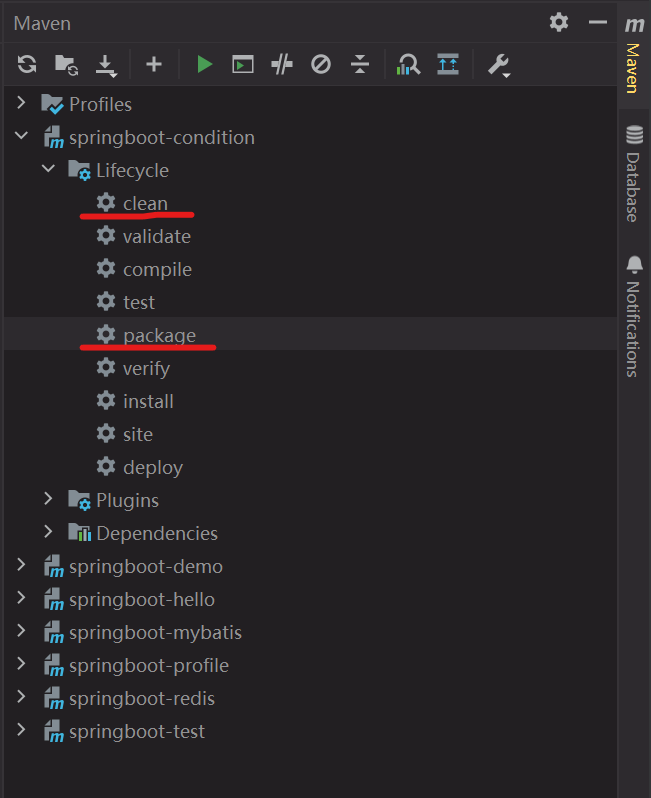

### war包方式
比较麻烦    
要在pom文件中添加
```xml
<packaging>war</packaging>
```
修改主启动类
```java
@SpringBootApplication
public class SpringbootConditionApplication extends SpringBootServletInitializer {

    public static void main(String[] args) {
        SpringApplication.run(SpringbootConditionApplication.class, args);
    }

    @Override
    protected SpringApplicationBuilder configure(SpringApplicationBuilder build) {
        return build;
    }

}
```
用上述的jar打包方式一样打包，在target中看到相应的war包
