# MySpringBoot

# 1.概述

## 1-1-spring boot概述

### spring的缺点：
* 1、配置繁琐
> 搭建ssm项目，需要配置大量xml。application.xml  spring-mybatis.xml  spring-mvc.xml
> 大量的bean。
* 2、依赖繁琐
> pom.xml要写大量依赖。pom.xml spring-core  spring-bean  spring-mvc  spring-mybatis
> 版本冲突spring-core 4.0 spring-mvc 5.0

### springboot概念
springboot提供了一种快速使用spring的方式，基于**约定优与配置**的思想，可以让开发人员不必在配置上
与逻辑业务之间进行思维的切换，全身心的投入到逻辑业务的代码编写中，从而大大提高了开发的效率。
这是官网地址[springboot](https://spring.io/projects/spring-boot)


### springboot功能
* 1、自动配置   
springboot的自动配置是一个允许时（更准确地说，是应用程序启动时）的过程，考虑了众多因数，才决定
spring配置应该用哪个，不该用哪个。该过程是springboot自动完成的

* 2、起步依赖   
起步依赖本质上是一个Maven项目对象模型（Project Object Model POM），定义了对其他库的
**传递依赖**，这些东西加在一起即支持某项功能。**依赖太多**，**版本冲突**。

简单的说，起步依赖就是将具备某种功能的坐标打包到一起，并提供一些默认的功能。
* 3、辅助功能    
提供了一些大项目中常见的非功能性特性：如嵌入式服务器（tomcat）、安全、指标、健康检测、外部配置等。

**注意：SpringBoot并不是对Spring功能上的增强，而是提供了一种快速使用Spring的方式。**

## 1-2-springboot快速入门
官网：https://spring.io/projects/spring-boot
1、完成搭建springboot工程，定义HellController.hello()方法，返回“Hello SpringBoot”。

2、实现步骤：

1: 创建Maven项目springboot-hello    
2：导入springboot起步依赖      
```xml
<!--springboot工程需要继承的父工程-->
    <parent>
        <groupId>org.springframework.boot</groupId>
        <artifactId>spring-boot-starter-parent</artifactId>
        <version>3.0.6</version>
        <relativePath/> <!-- lookup parent from repository -->
    </parent>

    <dependencies>
        <!--web开发的起步依赖-->
        <dependency>
            <groupId>org.springframework.boot</groupId>
            <artifactId>spring-boot-starter-web</artifactId>
        </dependency>
    </dependencies>
```
3、定义主启动类
```java
package com.hello;

import org.springframework.boot.SpringApplication;
import org.springframework.boot.autoconfigure.SpringBootApplication;

@SpringBootApplication // 表示这个类是springboot主启动类
public class HelloApplication {
    public static void main(String[] args) {
        SpringApplication.run(HelloApplication.class, args);
    }
}
```

4、编写HelloController
```java
package com.hello.controller;

import org.springframework.web.bind.annotation.GetMapping;
import org.springframework.web.bind.annotation.RequestMapping;
import org.springframework.web.bind.annotation.RestController;

@RestController
@RequestMapping("/hello")
public class HelloController {

    @GetMapping("/test")
    public String test() {
        return "Hello SpringBoot";
    }
}
```

5、启动测试
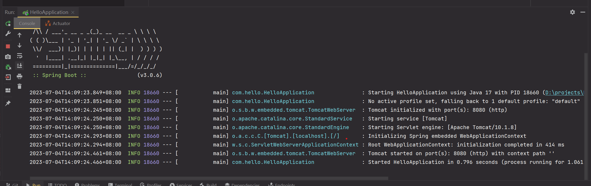
看到Started项目启动成功，打开浏览器输入127.0.0.1:8080/hello/test看到


### 总结
启动springboot一个web工程：    
1、pom规定父工程，导入web的起步依赖   
2、主启动类@SpringBootApplication、main   
3、业务逻辑controller、service、dao
* springboot在创建项目时，使用jar的打包方式。 java-jar xxx.jar
* springboot的引导类，是项目入口，运行main方法就可以启动项目。
* 使用springboot和spring构建的项目，业务代码编写方式完全一样。

## 1-3-快速构建spring boot工厂

使用Spring Initializr快速构建springboot项目     

步骤如下：
先选择你的Java版本号，项目名称等等

在选择依赖
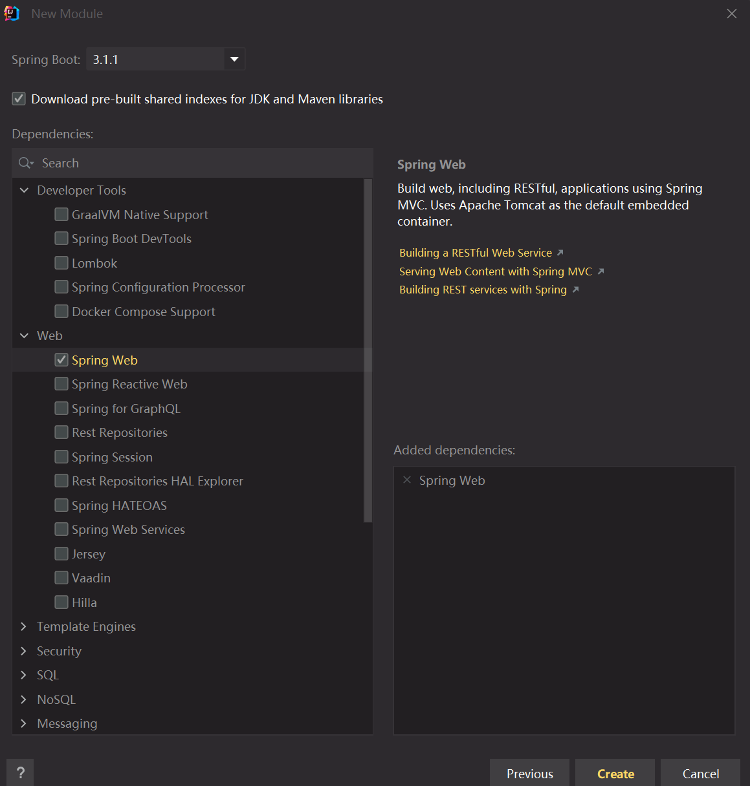
接下来idea会自己下载依赖，下载完成可以看到，这边自动帮你创建好了主启动类

编写controller
```java
@RestController
public class HelloController {

    @GetMapping("/hello")
    public String test() {
        return "Hello SpringBoot";
    }
}
```
启动测试，访问：http://127.0.0.1:8080/hello

## 1-4-spring boot起步依赖原理分析

我们在pom文件中按ctrl点击**spring-boot-starter-parent**

然后看到里面有个
```xml
<parent>
    <groupId>org.springframework.boot</groupId>
    <artifactId>spring-boot-dependencies</artifactId>
    <version>3.0.6</version>
  </parent>
```
再按上面的操作点**spring-boot-dependencies**

看到有个**dependencyManagement**这边规定好了要引入什么依赖

同理再看看**spring-boot-starter-web**
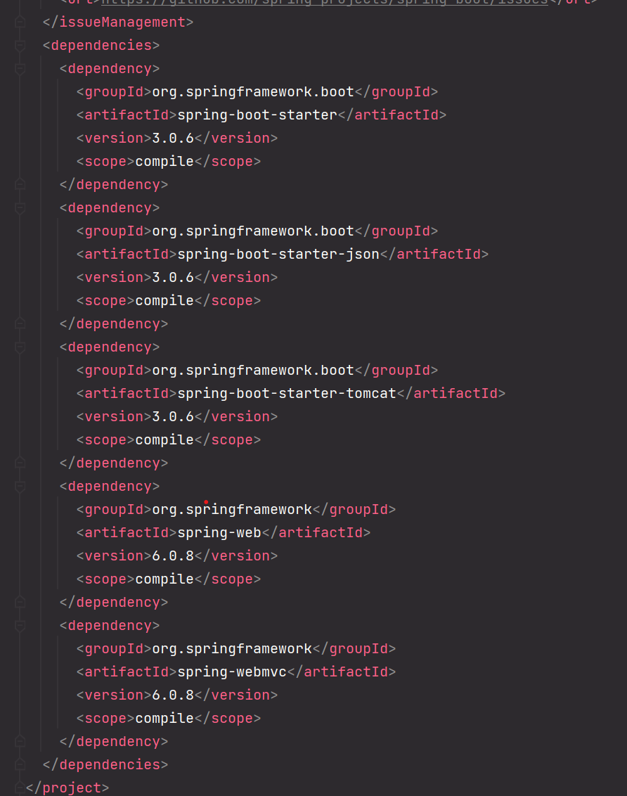
里面已经帮我们规定好了用**spring-web**什么版本，这也就是为什么我们没有引入tomcat，却能用的原因

总结：
* 在spring-boot-start-parent中定义了各种技术的版本信息，组合了一套最优搭配的技术版本。
* 在各种starter中，定义了完成该功能需要的坐标集合，其中大部分版本信息来自与父工程。
* 我们的工程继承parent，引入starter后，通过**依赖传递**，就可以简单获得需要的jar包，并且不会存在版本冲突等问题。

# 2.配置文件

## 2-1-spring boot配置文件-配置文件分类
springboot是基于约定的，所以很多都有默认值，但如果想使用总结的配置替换默认配置的话，就
可以使用application.properties或者application.yml(application.yaml)进行配置。

1.默认配置文件名称：application      
2.再同一级目录下有限集为properties > yml > yaml        
例如：配置内置tomcat的端口        
properties：
```xml
server.port=8080
```
yml:
```java
server:
    port: 8080
```
init工程：     
修改application.properties
```java
server.port=2023
```
新建application.yml
```java
server:
    port: 8088
```
启动测试：
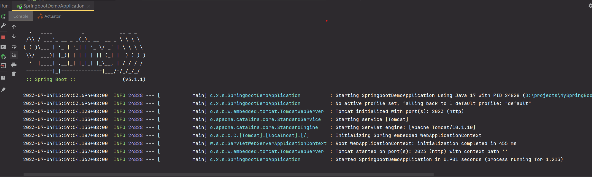
可以看到最后显示的端口是2023properties中配置的结果

## 2-2-spring boot配置文件-yml基本语法

### 1、概念：
yml是一种直观的能够被电脑识别的数据数据序列化格式，并且容易被人类阅读，容易和脚本语言交互的，
可以被支持YML库的不同编程语言程序导入。       

### 2、语法特点：
* 大小写敏感
* 数据值前边必须有空格，作为分隔符
* 使用缩进表示层级关系
* 缩进时不允许使用Tab键，只允许使用空格（各个系统Tab对应的空格数目可能不同，导致层次混乱）
* 缩进的空格数目不重要，只要相同层级的元素左侧对齐即可
* ‘#’表示注释，从这个字符一直到行尾，都会被解析器忽略
```yaml
server:
  port: 2024
  address: 127.0.0.1
name: xcc
```

## 2-3-spring boot配置文件-yml数据格式
**对象(map)**：键值对的集合：
```yaml
person1:
  name: hello
# 行内写法
person2： {name: world}
```
**数组**：一组按次序排列的值
```yaml
arry1:
  - springboot
  - springcloud
# 行内写法：
array2: [vue, react]
```
**纯量**：单个的、不可再分的值
```yaml
msg1: 'hello \n world'    # 单引号忽略转义字符
msg2: "Hi \n springboot"  # 双引号识别转义符号
```
**参数引用**
```yaml
xcc: linux
person:
  name: ${xcc}            # 引用上边定义的xcc值
```

## 2-4-spring boot配置文件-获取数据

### 1、@value
```java
    // 获取普通配置
    @Value("${name}")
    private String name;

    // 获取对象属性
    @Value("${person1.name}")
    private String name1;

    // 获取数组
    @Value("${array2[0]}")
    private String array1;

    // 获取纯量
    @Value("${msg1}")
    private String msg1;
```
### 2、Environment
```java
    @Autowired
    private Environment env;
    System.out.println("name1====="+env.getProperty("person1.name"));
    System.out.println("array1====="+env.getProperty("array2[0]"));
    System.out.println("msg1====="+env.getProperty("msg1"));
    System.out.println("name====="+env.getProperty("name"));
```

### 3、@ConfigurationProperties
**注意**：prefix一定要写
创建一个实体类Person
```java
package com.hello.entity;

import org.springframework.boot.context.properties.ConfigurationProperties;
import org.springframework.stereotype.Component;

import java.util.Arrays;

@Component
@ConfigurationProperties(prefix = "person")
public class Person {
    private String name;
    private int age;
    private String[] address;

    @Override
    public String toString() {
        return "Person{" +
                "name='" + name + '\'' +
                ", age=" + age +
                ", address=" + Arrays.toString(address) +
                '}';
    }

    public String getName() {
        return name;
    }

    public void setName(String name) {
        this.name = name;
    }

    public int getAge() {
        return age;
    }

    public void setAge(int age) {
        this.age = age;
    }

    public String[] getAddress() {
        return address;
    }

    public void setAddress(String[] address) {
        this.address = address;
    }
}
```

出现在这个不用慌。

要使用处理器，要有这个依赖。spring-boot-configuration-processor
再maven上加上依赖就好了
```xml
        <dependency>
            <groupId>org.springframework.boot</groupId>
            <artifactId>spring-boot-configuration-processor</artifactId>
            <optional>true</optional>
        </dependency>
```
HelloController类
```java
    @Autowired
    Person person;
    
    System.out.println(person.toString());
```

## 2-5-spring boot配置文件-profile-运维

### 1、背景：profile是用来完成不同环境下，配置动态切换功能的

### 2、profile配置方式
多profile文件方式：提供多个配置文件，每个代表一种环境。主配置文件application.properties配置：
> spring.profile.active=dev
* application-dev.properties/yml  开发环境
* application-test.properties/yml 测试环境
* application-pro.properties/yml  生产环境
 
yml多文档方式：       
再yml中使用  --- 分隔不同配置
```yaml
---
server:
  port: 8081
spring:
  profiles: dev
---
server:
  port: 8082
spring:
  profiles: test
---
server:
  port: 8083
spring:
  profiles: pro
---
spring:
  profiles:
    active: pro
```

**开发时候主要用这种方式**：多profile文件方式

### 3、profile激活方式
* 配置文件：再配置文件种配置：spring.profiles.active=dev
* 虚拟机参数：再VM options指定：-Dspring.profiles.active=pro
* 命令行参数：--spring.profiles.active=test

相当于上线时，运行jar包：java -jar xxx.jar --spring.profiles.active=pro        
测试：使用maven打包此项目，再target包种出现xxx.jar      
cmd 输入
```java
java -jar xxx.jar --spring.profiles.active=pro
```

## 2-6-spring boot配置文件-项目内部配置文件加载顺序

加载顺序为下文的排序顺序，高优先级配置的属性会生效
* file:./config/: 当前项目下的/config目录下
* file:./ : 当前项目的根目录
* classpath:/config/: classpath的/config目录
* classpath:/ : classpath的根目录

### 测试：
新建springboot-config目录，分别再以上目录创建配置文件。    
注意：
1、项目根目录为springboot-test。  
2、高级配置文件只覆盖低级配置文件的重复项。低级配置文件的独有项任然有效。最低级配置文件中添加：    
> server.servlet.context-path = /test

访问：http://127.0.0.1:8084/test/hello

## 2-7-spring boot配置文件-项目外部配置文件加载顺序

外部配置文件的使用是为了不修改配置文件做的       
### 1、命令行
> java -jar xxx.jar --name="Spring" --server.port=8008

### 2、指定配置文件位置
> java -jar xxx.jar --spring.config.location=d://application.properties

### 3、其他
https://docs.spring.io/spring-boot/docs/current/reference/html/features.html#features.external-config

作用：生产环境，随时改变环境变量时，可以通过改变配置文件来做。不需要重新打包项目。

# 3.整合框架

## 3-1-springboot整合junit

1、搭建springboot工程springboot-test。不引入依赖

2、引入start-test起步依赖
```xml
    <dependencies>
        <dependency>
            <groupId>org.springframework.boot</groupId>
            <artifactId>spring-boot-starter-web</artifactId>
        </dependency>

        <dependency>
            <groupId>org.springframework.boot</groupId>
            <artifactId>spring-boot-starter-test</artifactId>
            <scope>test</scope>
        </dependency>
    </dependencies>
```
3、编写UserService
```java
package com.xcc.service;

import org.springframework.stereotype.Service;

@Service
public class UserService {
    public void add() {
        System.out.println("Hello SpringBoot!");
    }
}
```
4、编写测试类UserServiceTest
```java
package com.xcc;

import com.xcc.service.UserService;
import org.junit.jupiter.api.Test;
import org.springframework.beans.factory.annotation.Autowired;
import org.springframework.boot.test.context.SpringBootTest;

@SpringBootTest(classes = SpringbootTestApplication.class) // 这是springboot测试类，容器就起来了
public class UserServiceTest {

    @Autowired
    private UserService userService;

    @Test
    public void test() {
        userService.add();
    }

}
```

## 3-2-springboot整合mybatis

1、搭建springboot工程springboot-mybatis

2、引入mybatis起步依赖，添加mysql驱动
```xml
    <dependencies>
        <dependency>
            <groupId>org.springframework.boot</groupId>
            <artifactId>spring-boot-starter-web</artifactId>
        </dependency>

        <dependency>
            <groupId>org.springframework.boot</groupId>
            <artifactId>spring-boot-starter-test</artifactId>
            <scope>test</scope>
        </dependency>

        <!-- https://mvnrepository.com/artifact/org.mybatis.spring.boot/mybatis-spring-boot-starter -->
        <dependency>
            <groupId>org.mybatis.spring.boot</groupId>
            <artifactId>mybatis-spring-boot-starter</artifactId>
            <version>2.3.0</version>
        </dependency>

        <!-- https://mvnrepository.com/artifact/mysql/mysql-connector-java -->
        <dependency>
            <groupId>mysql</groupId>
            <artifactId>mysql-connector-java</artifactId>
            <version>5.1.4</version>
        </dependency>
    </dependencies>
```
3、数据库创建张表
```mysql
CREATE TABLE `person` (
  `id` bigint(20) NOT NULL AUTO_INCREMENT COMMENT '主键id',
  `name` varchar(255) DEFAULT NULL COMMENT '姓名',
  `age` int(11) DEFAULT NULL COMMENT '年龄',
  PRIMARY KEY (`id`)
) ENGINE=InnoDB DEFAULT CHARSET=utf8;
```
4、配置文件
```yaml
spring:
  datasource:
    #?serverTimezone=UTC解决时区的报错
    url: jdbc:mysql://localhost:3306/mysql_demo?serverTimezone=UTC&useUnicode=true&characterEncoding=utf-8
    driver-class-name: com.mysql.jdbc.Driver
    username: root
    password: root
mybatis:
  mapper-locations: classpath:mapper/*
```
5、实体类
```java
package com.xcc.springbootmybatis.entity;

public class Person {
    private Long id;
    private String name;
    private int age;

    public Person() {}

    public Person(Long id, String name, int age) {
        this.id = id;
        this.name = name;
        this.age = age;
    }

    @Override
    public String toString() {
        return "Person{" +
                "id=" + id +
                ", name='" + name + '\'' +
                ", age=" + age +
                '}';
    }

    public Long getId() {
        return id;
    }

    public void setId(Long id) {
        this.id = id;
    }

    public String getName() {
        return name;
    }

    public void setName(String name) {
        this.name = name;
    }

    public int getAge() {
        return age;
    }

    public void setAge(int age) {
        this.age = age;
    }
}
```
6、DAO接口
注解方式的
```java
package com.xcc.springbootmybatis.mapper;

import com.xcc.springbootmybatis.entity.Person;
import org.apache.ibatis.annotations.Mapper;
import org.apache.ibatis.annotations.Select;

import java.util.List;

@Mapper
public interface PersonMapper {
    @Select("select * from Person")
    List<Person> list();
}
```
使用XML方式的
```java
package com.xcc.springbootmybatis.mapper;

import com.xcc.springbootmybatis.entity.Person;
import org.apache.ibatis.annotations.Mapper;

import java.util.List;

@Mapper
public interface PersonXMLMapper {
    List<Person> list();
}

```
7、xml文件
```xml
<?xml version="1.0" encoding="UTF-8" ?>
<!DOCTYPE mapper
        PUBLIC "-//mybatis.org//DTD Mapper 3.0//EN"
        "http://mybatis.org/dtd/mybatis-3-mapper.dtd">
<mapper namespace="com.xcc.springbootmybatis.mapper.PersonXMLMapper">

    <select id="list" resultType="com.xcc.springbootmybatis.entity.Person">
        select * from Person
    </select>
</mapper>
```
8、测试
```java
package com.xcc.springbootmybatis;

import com.xcc.springbootmybatis.entity.Person;
import com.xcc.springbootmybatis.mapper.PersonMapper;
import com.xcc.springbootmybatis.mapper.PersonXMLMapper;
import org.junit.jupiter.api.Test;
import org.springframework.beans.factory.annotation.Autowired;
import org.springframework.boot.test.context.SpringBootTest;

import java.util.List;

@SpringBootTest
public class PersonTest {

    @Autowired
    private PersonMapper personMapper;

    @Autowired
    private PersonXMLMapper personXMLMapper;

    @Test
    public void test() {
        List<Person> list = personMapper.list();
        System.out.println(list);
    }

    @Test
    public void demo() {
        List<Person> list = personXMLMapper.list();
        System.out.println(list);
    }

}
```
## 3-3-springboot整合redis

1、搭建springboot工程springboot-redis

2、引入redis依赖     
如果不知道怎么找依赖的话，直接再这个官网 https://mvnrepository.com/ 上搜索
```xml
<dependencies>
        <dependency>
            <groupId>org.springframework.boot</groupId>
            <artifactId>spring-boot-starter-web</artifactId>
        </dependency>

        <dependency>
            <groupId>org.springframework.boot</groupId>
            <artifactId>spring-boot-starter-test</artifactId>
            <scope>test</scope>
        </dependency>

        <!-- https://mvnrepository.com/artifact/org.springframework.boot/spring-boot-starter-data-redis -->
        <dependency>
            <groupId>org.springframework.boot</groupId>
            <artifactId>spring-boot-starter-data-redis</artifactId>
            <version>3.1.0</version>
        </dependency>
    </dependencies>
```
3、修改配置文件
```yaml
spring:
  redis:
    host: 127.0.0.1
    prot: 6379
```
4、编写测试类
```java
package com.xcc.springbootredis;

import org.junit.jupiter.api.Test;
import org.springframework.beans.factory.annotation.Autowired;
import org.springframework.boot.test.context.SpringBootTest;
import org.springframework.data.redis.core.RedisTemplate;

@SpringBootTest
public class RedisTest {

    @Autowired
    RedisTemplate redisTemplate;

    @Test
    public void test1() {
        redisTemplate.opsForValue().set("a","Hello");

        redisTemplate.boundValueOps("b").set("Redis");
    }

    @Test
    public void test2() {
        Object c = redisTemplate.opsForValue().get("a");
        System.out.println(c);
        Object d = redisTemplate.boundValueOps("b").get();
        System.out.println(d);
    }
}
```

## 4、springboot自动配置

### Condition
Condition是spring4.0后引入的条件配置接口，通过实现Condition接口可以完成有条件的加载相应的Bean      
@Condition要配和Condition的实现类(ClassCondition)进行使用  
1、创建模块springboot-condition

2、观察spring在自动创建bean过程   
改造启动类
```java
@SpringBootApplication
public class SpringbootConditionApplication {

    public static void main(String[] args) {
        // 返回spring容器
        ConfigurableApplicationContext context = SpringApplication.run(SpringbootConditionApplication.class, args);

        // 获取redisTemplate这个bean对象
        Object redisTemplate = context.getBean("redisTemplate");
        System.out.println(redisTemplate);

    }

}
```
启动：获取不到对象
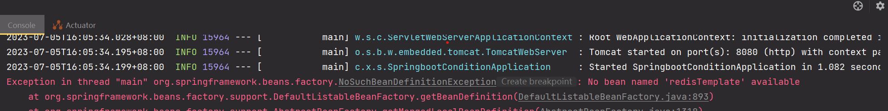
加上redis的依赖
```xml
<!-- https://mvnrepository.com/artifact/org.springframework.boot/spring-boot-starter-data-redis -->
        <dependency>
            <groupId>org.springframework.boot</groupId>
            <artifactId>spring-boot-starter-data-redis</artifactId>
            <version>3.1.0</version>
        </dependency>
```
可以看到
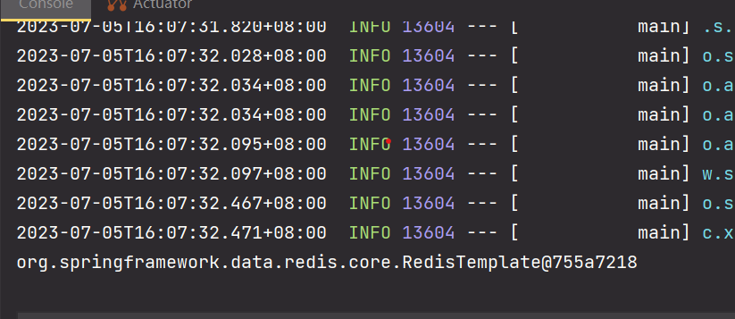
只要引入依赖，就可以再spring的容器中获取对象

创建一个实体类
```java
package com.xcc.springbootcondition.domain;

public class User {
}
```
再创建一个配置类
```java
package com.xcc.springbootcondition.config;

import com.xcc.springbootcondition.domain.User;
import org.springframework.context.annotation.Bean;
import org.springframework.context.annotation.Configuration;

// 配置类
@Configuration
public class UserConfig {

    @Bean
    public User user() {
        return new User();
    }
}
```
验证
```java
@SpringBootApplication
public class SpringbootConditionApplication {
    public static void main(String[] args) {
        // 返回spring容器
        ConfigurableApplicationContext context = SpringApplication.run(SpringbootConditionApplication.class, args);

        // 获取redisTemplate这个bean对象
//        Object redisTemplate = context.getBean("redisTemplate");
//        System.out.println(redisTemplate);

        // 通过名字拿bean对象
//        User user = (User) context.getBean("user");
//        System.out.println(user);

        // 通过类型拿bean对象
        User user = (User) context.getBean(User.class);
        System.out.println(user);
    }
}
```
刚才我们写了一个配置类UserConfig，当我们启动springboot的时候会自动帮我们创建User对象。     

但一般启动项目的时候就要创建某个对象，都要有个前置条件     
举个例子：你的配置文件中要有下面这个；才能创建User对象
```yaml
ipAddress: localhost
```
可以利用springboot的
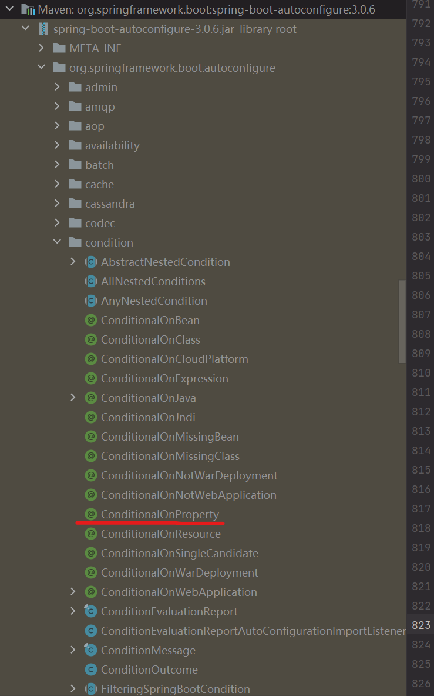
改造配置类UserConfig
```java
    @Bean
    @ConditionalOnProperty(name = "ipAddress", havingValue="localhost")
    public User user2() {
        return new User();
    }
```
主启动类打印
```java
ConfigurableApplicationContext context = SpringApplication.run(SpringbootConditionApplication.class, args);
User user2 = (User) context.getBean("user2");
System.out.println(user2);
```
然后启动就可以看到
> com.xcc.springbootcondition.domain.User@4af7dd6a

这是springboot自带的，我们也可以根据源码自己写个自己的    

先看一下这边有很多个注解ConditionalOnBean,ConditionalOnClass等等。点进去看看


我们可以看到这些注解都是有3个注解，Target，Retention，Documented   
看看官网：https://docs.spring.io/spring-boot/docs/current/reference/html/features.html#features.developing-auto-configuration
* Target : 可以用在哪些地方
* Retention : 什么时候起作用
* Documented : 生成javadoc

我们也按葫芦画瓢；写这个自己的注解
创建自己的ConditionalOnClass注解
```java
package com.xcc.springbootcondition.condition;

import org.springframework.context.annotation.Conditional;

import java.lang.annotation.*;

@Target({ElementType.TYPE, ElementType.METHOD})            
@Retention(RetentionPolicy.RUNTIME)                         
@Documented
public @interface ConditionalOnClass {
}
```
光有这些还不够，还要加上@Conditional,要有对应的类OnClassCondition，OnBeanCondition等等
```java
@Conditional(ClassCondition.class)
```
这里我们建个ClassCondition类
```java
public class ClassCondition{
}
```
然后我们在看看源码**Conditional**干了什么事的
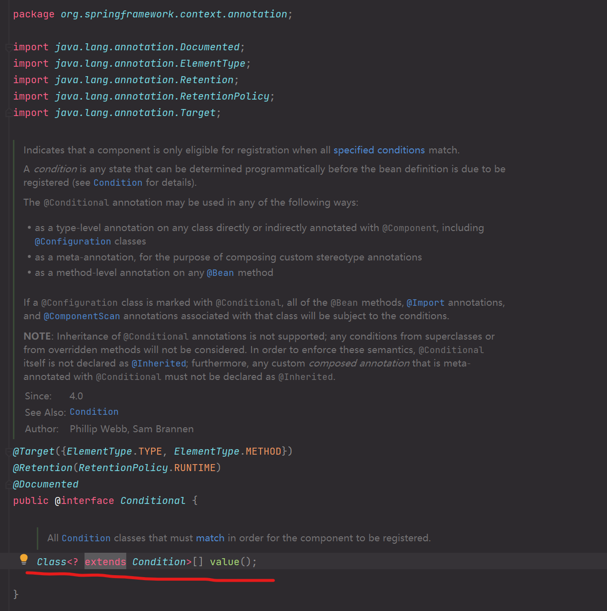
> Class<? extends Condition>[] value();

这注解要继承一个**Condition**在改造一下我们创建的ClassCondition类
```java
public class ClassCondition implements Condition {
    @Override
    public boolean matches(ConditionContext context, AnnotatedTypeMetadata metadata) {
        return false;
    }
}
```
分析：     
我们建了一个类然后继承了ClassCondition类，还实现了matches这个方法，这个方法返回一个boolean。    
就是说这边是可以加上我们自己写的逻辑，然后判断返回一个boolean从而决定某个bean对象是否生成。     
我们的自己的注解在加上要传的参数就好了
```java
@Target({ElementType.TYPE, ElementType.METHOD})             
@Retention(RetentionPolicy.RUNTIME)                         
@Documented                                                 
@Conditional(ClassCondition.class)
public @interface ConditionalOnClass {
    String[] value();       // 注解参数
}
```
然后就是ClassCondition类添加逻辑
```java
public class ClassCondition implements Condition {
    @Override
    public boolean matches(ConditionContext context, AnnotatedTypeMetadata metadata) {
        try {
            Map<String, Object> map = metadata.getAnnotationAttributes("com.xcc.springbootcondition.condition.ConditionalOnClass");
            System.out.println(map);

            String [] values = (String[]) map.get("value");
            for (String value : values) {
                Class.forName(value);
            }
            return true;
        } catch (Exception e) {
            return false;
        }
    }
}
```
配置类UserConfig
```java
@Configuration
public class UserConfig {
    @Bean
    @ConditionalOnClass({"redis.clients.jedis.Jedis"})
    public User user() {
        return new User();
    }
}
```
### 切换内置web服务器
我们创建springboot工程的时候引入了web，在启动的报文里会看到：
> o.s.b.w.embedded.tomcat.TomcatWebServer  : Tomcat initialized with port(s): 8080 (http)

springboot默认了端口和tomcat。我们的springboot需要引入spring-boot-starter-web，    
我们就看看spring-boot-starter-web的里面：
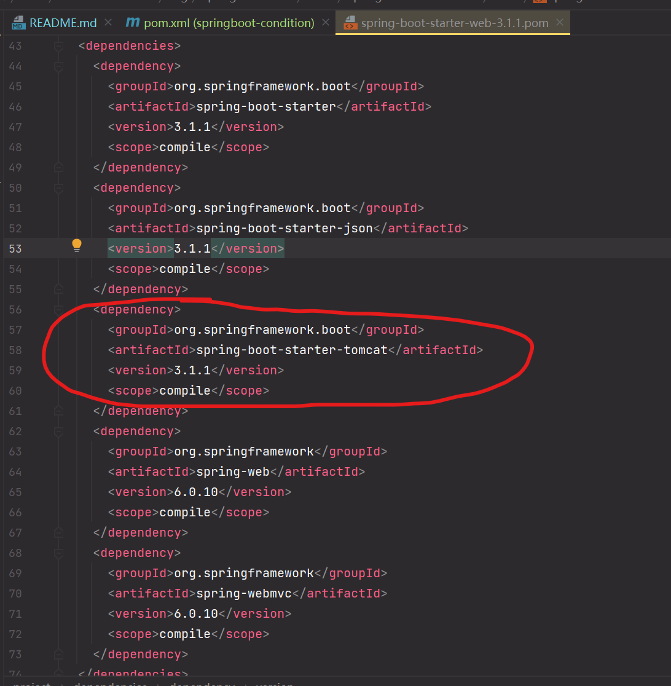
里面引了tomcat，在点进去

这边已经引入的tomcat。
在看看springboot的配置

这边EmbeddedWebServerFactoryCustomizerAutoConfiguration就是个配置里面看到了@ConditionalOnClass({ Tomcat.class, UpgradeProtocol.class })
这个就是查项目有没有引入tomcat的，和刚才我们自己写的注解一样的道理。

为什么springboot启动是默认用tomcat了，因为引入的依赖spring-boot-starter-web中就有tomcat，
而spring-boot-autoconfigure中又检查项目有没有引入tomcat，引入就创建相应的bean

要是想不用tomcat使用别的容器修改pom文件就好
```xml
        <dependency>
            <groupId>org.springframework.boot</groupId>
            <artifactId>spring-boot-starter-web</artifactId>
            <exclusions>
                <exclusion>
                    <groupId>org.springframework.boot</groupId>
                    <artifactId>spring-boot-starter-tomcat</artifactId>
                </exclusion>
            </exclusions>
        </dependency>

        <!-- https://mvnrepository.com/artifact/org.springframework.boot/spring-boot-starter-jetty -->
        <dependency>
            <groupId>org.springframework.boot</groupId>
            <artifactId>spring-boot-starter-jetty</artifactId>
            <version>2.7.8</version>
        </dependency>
```
在启动的报文中可以看见：


springboot工程，只要你引入了web依赖，就会自动加载spring-boot-autoconfigure。
autoconfig工程里都有常用的配置类，只要工程中，引入了相关起步依赖，这些对象我们本项目的容器中就有了。

### Enable
springboot虽然准备了很多常用的配置类，但是一般我们在实际开发中会引用别的类像：阿里云，七牛云等等；      
举个例子：我们创建两个springboot工程，springboot-enable，springboot-enable-other

在springboot-enable-other中加个Person类
```java
package com.xcc.springbootenableother.demain;

public class Person {
}
```
再来个配置类PersonConfig
```java
package com.xcc.springbootenableother.config;

import com.xcc.springbootenableother.demain.Person;
import org.springframework.context.annotation.Bean;
import org.springframework.context.annotation.Configuration;

// 配置类注解
@Configuration
public class PersonConfig {

    @Bean
    public Person person() {
        return new Person();
    }
}
```
启动的时候bean中就会有Person这个对象。然后再springboot-enable的pom加上springboot-enable-other
```xml
        <dependency>
            <groupId>com.xcc</groupId>
            <artifactId>springboot-enable-other</artifactId>
            <version>0.0.1-SNAPSHOT</version>
        </dependency>
```
springboot-enable-other的主启动类改一下
```java
@SpringBootApplication
public class SpringbootEnableApplication {
    public static void main(String[] args) {
        ConfigurableApplicationContext context = SpringApplication.run(SpringbootEnableApplication.class, args);

        Person perosn = (Person) context.getBean("person");
        System.out.println(perosn);
    }
}
```
启动
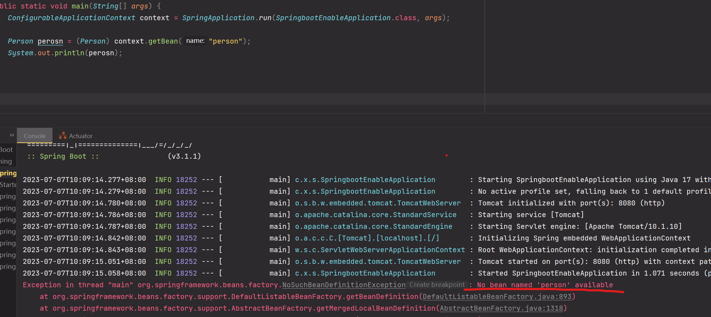
可以看到No bean named 'person' available。容器中没有person这个对象。    
springboot不能直接获取在其他工程中定义的Bean
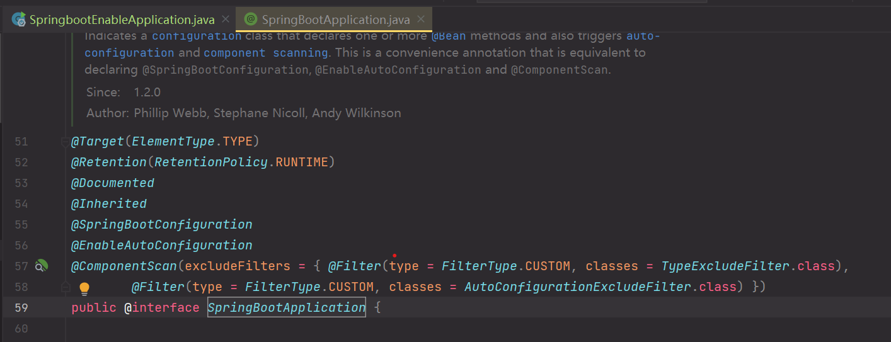
主要是这三个注解，上面那几个是元注解
* SpringBootConfiguration   // 自动配置相关
* EnableAutoConfiguration   // 扫描应用程序中的所有组件，自动配置Spring需要的组件
* ComponentScan             // 扫本包及子包，根据扫描的规则找出哪些需要自动装配到spring的bean容器中

分析：之前的redis我们只要在pom文件那边引入依赖就可以在容器中获取了，是因为springboot常用的配置中就有的。系统启动才能在容器中获取。
而刚才这个只是引入了，相应的配置类并没有，在springboot-enable中没，在根据上面的3个注解，其实就是缺配置。加配置也3种方法：

1、扫描第三方jar包的配置类。
```java
@ComponentScan("com.xcc.springbootenableother.config")
@SpringBootApplication
public class SpringbootEnableApplication {

    public static void main(String[] args) {
        ConfigurableApplicationContext context = SpringApplication.run(SpringbootEnableApplication.class, args);

        Person perosn = (Person) context.getBean("person");
        System.out.println(perosn);
    }

}
```
2、把第三方配置类引进来。
```java
@Import(PersonConfig.class)
@SpringBootApplication
public class SpringbootEnableApplication {

    public static void main(String[] args) {
        ConfigurableApplicationContext context = SpringApplication.run(SpringbootEnableApplication.class, args);

        Person perosn = (Person) context.getBean("person");
        System.out.println(perosn);
    }

}
```
3、第三方注解封装好。     
springboot-enable-other添加个注解类
```java
package com.xcc.springbootenableother.config;

import org.springframework.context.annotation.Import;

import java.lang.annotation.*;

@Target(ElementType.TYPE)
@Retention(RetentionPolicy.RUNTIME)
@Documented
@Inherited
@Import(PersonConfig.class)
public @interface EnablePerson {
}
```
springboot-enable的主启动类加上写好的注解类@EnablePerson
```java
@EnablePerson
@SpringBootApplication
public class SpringbootEnableApplication {

    public static void main(String[] args) {
        ConfigurableApplicationContext context = SpringApplication.run(SpringbootEnableApplication.class, args);

        Person perosn = (Person) context.getBean("person");
        System.out.println(perosn);
    }

}
```
一般开发的时候用第三种方法，前面两个太麻烦了：一个你要知道配置类的全限名，一个你要知道配置类是啥

### Import

@Enable底层依赖与@Import注解导入一些类，使用@Import导入的类会被spring加载到IOC容器中：@Import提供了4种用法：

1、导入Bean
```java
@Import(Person.class)
```

2、导入配置类
```java
@Import(PersonConfig.class)
```

3、导入ImportSelector实现类。一般用于加载配置文件中的类

先创建自己的MyImportSelector类实现ImportSelector的selectImports
```java
public class MyImportSelector implements ImportSelector {
    @Override
    public String[] selectImports(AnnotationMetadata importingClassMetadata) {
        return new String[]{"com.xcc.springbootenableother.demain.Person"};
    }
}
```
再主启动类添加注解
```java
@Import(MyImportSelector.class)
```
4、导入ImportBeanDefinitionRegistrar实现类

先创建自己的MyImportBeanDefinitionRegistrar类实现ImportBeanDefinitionRegistrar
```java
public class MyImportBeanDefinitionRegistrar implements ImportBeanDefinitionRegistrar {

    @Override
    public void registerBeanDefinitions(AnnotationMetadata importingClassMetadata,
                                        BeanDefinitionRegistry registry,
                                        BeanNameGenerator importBeanNameGenerator) {
        AbstractBeanDefinition beanDefinition = BeanDefinitionBuilder.
                rootBeanDefinition(Person.class).getBeanDefinition();
        registry.registerBeanDefinition("Person", beanDefinition);
    }
}
```
主启动类添加注解
```java
@Import(MyImportBeanDefinitionRegistrar.class)
```
获取方式
```java
        Map<String, Person> map = context.getBeansOfType(Person.class);
        System.out.println(map);
```

### springboot自动配置-@EnableAutoConfiguration
主启动类这边点进@SpringBootApplication

点进@EnableAutoConfiguration，看到了Import有个AutoConfigurationImportSelector类，就是刚才Import的第三种用法，springboot这边默认用的这种方式

在进去看到AutoConfigurationImportSelector实现了DeferredImportSelector

DeferredImportSelector中在看看这边是继承了ImportSelector
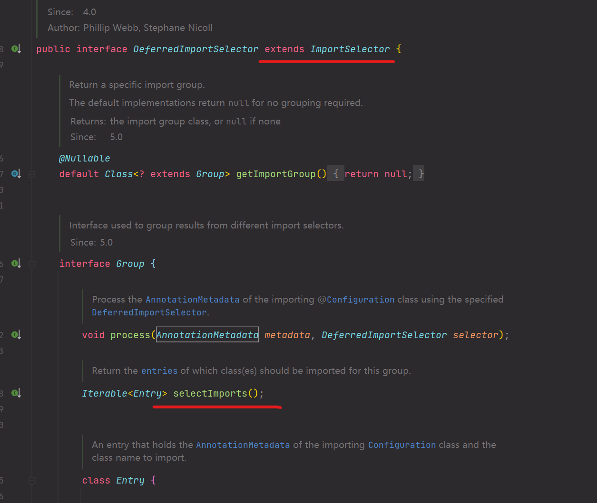
这也确定了EnableAutoConfiguration是靠import实现了自动配置，之前自己写的一个MyImportSelector类，中是实现了selectImports这个方法，
那么在AutoConfigurationImportSelector是实现了DeferredImportSelector，DeferredImportSelector是继承了ImportSelector，
所以AutoConfigurationImportSelector中有个方法和我之前的MyImportSelector干了同样的事。

> Assert.notEmpty(configurations,
> "No auto configuration classes found in "
> + "META-INF/spring/org.springframework.boot.autoconfigure.AutoConfiguration.imports. If you "
> + "are using a custom packaging, make sure that file is correct.");

通过这边的提示可以知道springboot的配置信息在META-INF/spring/org.springframework.boot.autoconfigure.AutoConfiguration.imports

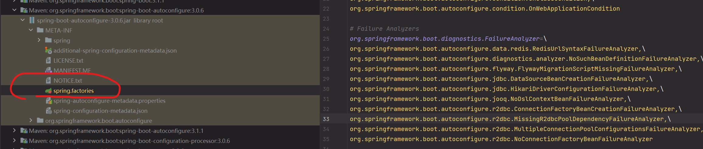

* @EnableAutoConfiguration注解内部使用@Import(AutoConfigurationImportSelector.class)来加载配置类。
* 配置文件位置：META-INF/spring.factories,该配置文件中定义了大量的配置类，当springboot应用启动时，会自动加载这些配置类，初始化Bean
* 并不是所有Bean都会被初始化，在配置类中使用Condition来加载满足条件的Bean

## 5、springboot自定义starter

我们可以模仿看到的方式，写个自己的starter。  
例如：mybatis-spring-boot--starter,mybatis-spring-boot-autoconfigure   
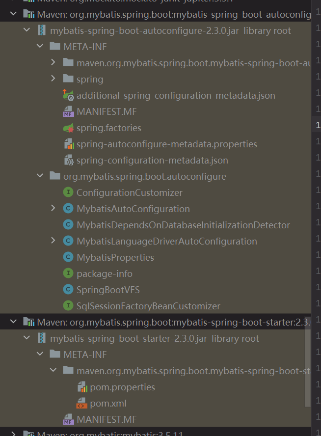  

### 搭建项目
redis-spring-boot-autoconfigure   
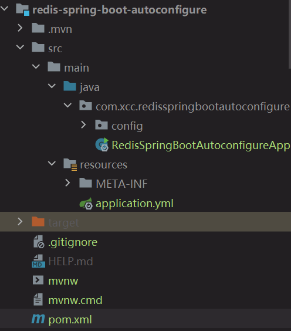   
pom.xml文件
```xml
<dependencies>
    <dependency>
        <groupId>org.springframework.boot</groupId>
        <artifactId>spring-boot-starter</artifactId>
    </dependency>
    <dependency>
        <groupId>redis.clients</groupId>
        <artifactId>jedis</artifactId>
        <version>4.4.3</version>
    </dependency>
</dependencies>
```

redis-spring-boot-starter
   
pom.xml文件
```xml
    <dependencies>
        <dependency>
            <groupId>org.springframework.boot</groupId>
            <artifactId>spring-boot-starter-web</artifactId>
        </dependency>
        <dependency>
            <groupId>com.xcc</groupId>
            <artifactId>redis-spring-boot-autoconfigure</artifactId>
            <version>0.0.1-SNAPSHOT</version>
        </dependency>
    </dependencies>
```

### 配置文件-RedisProperties
```java
@ConfigurationProperties(prefix = "redis")
public class RedisProperties {

    private String host = "localhost";
    private int port = 6379;

    public String getHost() {
        return host;
    }

    public void setHost(String host) {
        this.host = host;
    }

    public int getPort() {
        return port;
    }

    public void setPort(int port) {
        this.port = port;
    }
}
```

### 配置文件-RedisAutoConfigure
```java
@Configuration
@EnableConfigurationProperties(com.xcc.redisspringbootautoconfigure.config.RedisProperties.class)
@ConditionalOnClass(Jedis.class)
public class RedisAutoConfigure {
    @Bean
    public Jedis jedis(com.xcc.redisspringbootautoconfigure.config.RedisProperties redisProperties) {
        return new Jedis(redisProperties.getHost(), redisProperties.getPort());
    }
}
```

### 配置文件-spring.factories
```
# Auto Configure
org.springframework.boot.autoconfigure.EnableAutoConfiguration=\
package com.xcc.redisspringbootautoconfigure.config.RedisAutoConfigures
```

### 测试
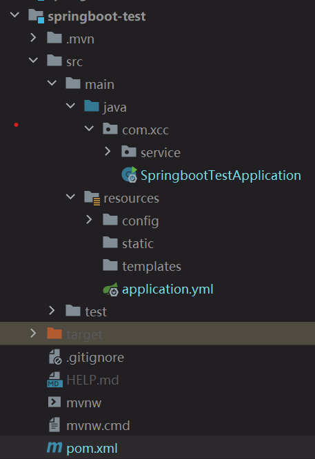   
在pom.xml文件中添加
```xml
        <dependency>
            <groupId>com.xcc</groupId>
            <artifactId>redis-spring-boot-starter</artifactId>
            <version>0.0.1-SNAPSHOT</version>
        </dependency>
```
启动本地的redis，事先添加个元素的     
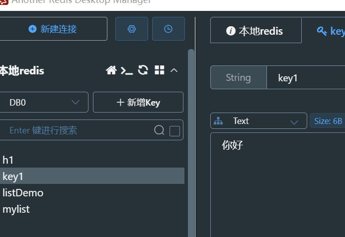

```java
@SpringBootApplication
public class SpringbootTestApplication {

    public static void main(String[] args) {
        ConfigurableApplicationContext context = SpringApplication.run(SpringbootTestApplication.class, args);

        Jedis jedis = (Jedis) context.getBean("jedis");
        System.out.println(jedis);
        String a = jedis.get("key1");
        System.out.println(a);
        String b = jedis.set("key2", "halo");
        System.out.println(b);
        String c = jedis.get("key2");
        System.out.println(c);
    }

}
```
启动：     
       
yml文件中添加个redis
```yaml
redis:
  host: 11.152.11.23
  port: 6379
```


## 6、springboot事件监听

Java中的事件监听机制定义了以下几个角色：  
1、事件：Event，继承java.util.EventObject类的对象  
2、事件源：Source，任意对象Object     
3、监听器：Listener，实现java.util.EventListener接口的对象       

Springboot在项目启动时，会对几个监听器进行回调：   
1、ApplicationRunner     
创建ApplicationRunnerDemo类
```java
@Component
public class ApplicationRunnerDemo implements ApplicationRunner {
    @Override
    public void run(ApplicationArguments args) throws Exception {
        // 链接一下数据库，业务代码实现
        System.out.println("ApplicationRunnerDemo run 程序启动了！");
    }
}
```
2、CommandLineRunner     
创建CommandLineRunnerDemo类
```java
@Component
public class CommandLineRunnerDemo implements CommandLineRunner {
    @Override
    public void run(String... args) throws Exception {
        System.out.println("CommandLineRunnerDemo run 程序启动了！");
    }
}
```
3、ApplicationContextInitializer     
创建ApplicationContextInitializerDemo类
```java
public class ApplicationContextInitializerDemo implements ApplicationContextInitializer {
    // 监听更早，可以做一些资源的检查，redis有没有启动等等
    @Override
    public void initialize(ConfigurableApplicationContext applicationContext) {
        System.out.println("ApplicationContextInitializerDemo initialize ");
    }
}
```
还需要在resources下创建META-INF/spring.factories
```
org.springframework.context.ApplicationContextInitializer=com.xcc.springbootlistener.listener.ApplicationContextInitializerDemo
```
4、SpringApplicationRunListener
创建SpringApplicationRunListenerDemo类
```java
public class SpringApplicationRunListenerDemo implements SpringApplicationRunListener {

    public SpringApplicationRunListenerDemo(SpringApplication application, String[] args) {}

    @Override
    public void starting(ConfigurableBootstrapContext bootstrapContext) {
        SpringApplicationRunListener.super.starting(bootstrapContext);
        System.out.println("SpringApplicationRunListenerDemo  starting ");
    }

    @Override
    public void environmentPrepared(ConfigurableBootstrapContext bootstrapContext, ConfigurableEnvironment environment) {
        SpringApplicationRunListener.super.environmentPrepared(bootstrapContext, environment);
        System.out.println("SpringApplicationRunListenerDemo  environmentPrepared ");
    }

    @Override
    public void contextPrepared(ConfigurableApplicationContext context) {
        SpringApplicationRunListener.super.contextPrepared(context);
        System.out.println("SpringApplicationRunListenerDemo  contextPrepared ");
    }

    @Override
    public void contextLoaded(ConfigurableApplicationContext context) {
        SpringApplicationRunListener.super.contextLoaded(context);
        System.out.println("SpringApplicationRunListenerDemo  contextLoaded ");
    }

    @Override
    public void started(ConfigurableApplicationContext context, Duration timeTaken) {
        SpringApplicationRunListener.super.started(context, timeTaken);
        System.out.println("SpringApplicationRunListenerDemo  started ");
    }

    @Override
    public void ready(ConfigurableApplicationContext context, Duration timeTaken) {
        SpringApplicationRunListener.super.ready(context, timeTaken);
        System.out.println("SpringApplicationRunListenerDemo  ready ");
    }

    @Override
    public void failed(ConfigurableApplicationContext context, Throwable exception) {
        SpringApplicationRunListener.super.failed(context, exception);
        System.out.println("SpringApplicationRunListenerDemo  failed ");
    }
}
```
还需要在resources下创建META-INF/spring.factories
```
org.springframework.boot.SpringApplicationRunListener=com.xcc.springbootlistener.listener.SpringApplicationRunListenerDemo
```

### 总结

1、ApplicationRunner和CommandLineRunner是程序启动晚后执行，可以做一些业务功能的处理   
2、ApplicationContextInitializer是程序还没启动执行，可以做资源的检查；例如redis有没有启动，没启动程序就没必要启动    
3、SpringApplicationRunListener功能全面，有程序启动前，后等等执行的，非常的全面

## 7、springboot流程分析

## 8、springboot监控

在pom文件添加jar
```xml
        <dependency>
            <groupId>org.springframework.boot</groupId>
            <artifactId>spring-boot-starter-actuator</artifactId>
        </dependency>
```

配置文件添加
```properties
management.endpoint.health.show-details=always
management.endpoints.web.exposure.include=*
```
访问localhost:8080/actuator       


现在有两个客户端，我想对两个客户端监控

#### 客户端1：springboot-admin-client1       
controller
```java
@RestController
public class helloController {

    @GetMapping("/hello")
    public String hello () {
        return "Hello";
    }
}
```
application.properties修改
```properties
server.port=8081
spring.boot.admin.client.url=http://localhost:9000

management.endpoint.health.show-details=always
management.endpoints.web.exposure.include=*
```
pom文件
```xml
<?xml version="1.0" encoding="UTF-8"?>
<project xmlns="http://maven.apache.org/POM/4.0.0" xmlns:xsi="http://www.w3.org/2001/XMLSchema-instance"
         xsi:schemaLocation="http://maven.apache.org/POM/4.0.0 https://maven.apache.org/xsd/maven-4.0.0.xsd">
    <modelVersion>4.0.0</modelVersion>
    <parent>
        <groupId>org.springframework.boot</groupId>
        <artifactId>spring-boot-starter-parent</artifactId>
        <version>3.1.2</version>
        <relativePath/> <!-- lookup parent from repository -->
    </parent>
    <groupId>com.xcc</groupId>
    <artifactId>springboot-admin-client1</artifactId>
    <version>0.0.1-SNAPSHOT</version>
    <name>springboot-admin-client1</name>
    <description>springboot-admin-client1</description>
    <properties>
        <java.version>17</java.version>
        <spring-boot-admin.version>3.1.1</spring-boot-admin.version>
    </properties>
    <dependencies>
        <dependency>
            <groupId>org.springframework.boot</groupId>
            <artifactId>spring-boot-starter-web</artifactId>
        </dependency>
        <dependency>
            <groupId>de.codecentric</groupId>
            <artifactId>spring-boot-admin-starter-client</artifactId>
        </dependency>

        <dependency>
            <groupId>org.springframework.boot</groupId>
            <artifactId>spring-boot-starter-test</artifactId>
            <scope>test</scope>
        </dependency>
    </dependencies>
    <dependencyManagement>
        <dependencies>
            <dependency>
                <groupId>de.codecentric</groupId>
                <artifactId>spring-boot-admin-dependencies</artifactId>
                <version>${spring-boot-admin.version}</version>
                <type>pom</type>
                <scope>import</scope>
            </dependency>
        </dependencies>
    </dependencyManagement>

    <build>
        <plugins>
            <plugin>
                <groupId>org.springframework.boot</groupId>
                <artifactId>spring-boot-maven-plugin</artifactId>
            </plugin>
        </plugins>
    </build>

</project>
```
启动      


#### 客户端2：springboot-admin-client2
controller
```java
@RestController
public class haloController {

    @GetMapping("/halo")
    public String halo() {
        return "Halo";
    }
}
```
application.properties
```properties
server.port=8082
spring.boot.admin.client.url=http://localhost:9000

management.endpoint.health.show-details=always
management.endpoints.web.exposure.include=*
```
pom文件
```xml
<?xml version="1.0" encoding="UTF-8"?>
<project xmlns="http://maven.apache.org/POM/4.0.0" xmlns:xsi="http://www.w3.org/2001/XMLSchema-instance"
         xsi:schemaLocation="http://maven.apache.org/POM/4.0.0 https://maven.apache.org/xsd/maven-4.0.0.xsd">
    <modelVersion>4.0.0</modelVersion>
    <parent>
        <groupId>org.springframework.boot</groupId>
        <artifactId>spring-boot-starter-parent</artifactId>
        <version>3.1.2</version>
        <relativePath/> <!-- lookup parent from repository -->
    </parent>
    <groupId>com.xcc</groupId>
    <artifactId>springboot-admin-client2</artifactId>
    <version>0.0.1-SNAPSHOT</version>
    <name>springboot-admin-client2</name>
    <description>springboot-admin-client2</description>
    <properties>
        <java.version>17</java.version>
        <spring-boot-admin.version>3.1.1</spring-boot-admin.version>
    </properties>
    <dependencies>
        <dependency>
            <groupId>org.springframework.boot</groupId>
            <artifactId>spring-boot-starter-web</artifactId>
        </dependency>
        <dependency>
            <groupId>de.codecentric</groupId>
            <artifactId>spring-boot-admin-starter-client</artifactId>
        </dependency>

        <dependency>
            <groupId>org.springframework.boot</groupId>
            <artifactId>spring-boot-starter-test</artifactId>
            <scope>test</scope>
        </dependency>
    </dependencies>
    <dependencyManagement>
        <dependencies>
            <dependency>
                <groupId>de.codecentric</groupId>
                <artifactId>spring-boot-admin-dependencies</artifactId>
                <version>${spring-boot-admin.version}</version>
                <type>pom</type>
                <scope>import</scope>
            </dependency>
        </dependencies>
    </dependencyManagement>

    <build>
        <plugins>
            <plugin>
                <groupId>org.springframework.boot</groupId>
                <artifactId>spring-boot-maven-plugin</artifactId>
            </plugin>
        </plugins>
    </build>

</project>
```
启动      


### 服务端：spring-boot-admin-server 负责监控前面两个客服端

application.properties
```properties
server.port=9000
```
pom文件
```xml
<?xml version="1.0" encoding="UTF-8"?>
<project xmlns="http://maven.apache.org/POM/4.0.0" xmlns:xsi="http://www.w3.org/2001/XMLSchema-instance"
         xsi:schemaLocation="http://maven.apache.org/POM/4.0.0 https://maven.apache.org/xsd/maven-4.0.0.xsd">
    <modelVersion>4.0.0</modelVersion>
    <parent>
        <groupId>org.springframework.boot</groupId>
        <artifactId>spring-boot-starter-parent</artifactId>
        <version>3.1.2</version>
        <relativePath/> <!-- lookup parent from repository -->
    </parent>
    <groupId>com.xcc</groupId>
    <artifactId>springboot-admin-server</artifactId>
    <version>0.0.1-SNAPSHOT</version>
    <name>springboot-admin-server</name>
    <description>springboot-admin-server</description>
    <properties>
        <java.version>17</java.version>
        <spring-boot-admin.version>3.1.1</spring-boot-admin.version>
    </properties>
    <dependencies>
        <dependency>
            <groupId>de.codecentric</groupId>
            <artifactId>spring-boot-admin-starter-server</artifactId>
        </dependency>

        <dependency>
            <groupId>org.springframework.boot</groupId>
            <artifactId>spring-boot-starter-test</artifactId>
            <scope>test</scope>
        </dependency>
    </dependencies>
    <dependencyManagement>
        <dependencies>
            <dependency>
                <groupId>de.codecentric</groupId>
                <artifactId>spring-boot-admin-dependencies</artifactId>
                <version>${spring-boot-admin.version}</version>
                <type>pom</type>
                <scope>import</scope>
            </dependency>
        </dependencies>
    </dependencyManagement>

    <build>
        <plugins>
            <plugin>
                <groupId>org.springframework.boot</groupId>
                <artifactId>spring-boot-maven-plugin</artifactId>
            </plugin>
        </plugins>
    </build>

</project>
```
主启动类
```java
@SpringBootApplication
@EnableAdminServer
public class SpringbootAdminServerApplication {

    public static void main(String[] args) {
        SpringApplication.run(SpringbootAdminServerApplication.class, args);
    }

}
```
启动访问：localhost:9000         


## 9、springboot部署
springboot的部署：
* 打成jar包
* 打成war包

### jar包方式
打开idea的maven这边，点击package
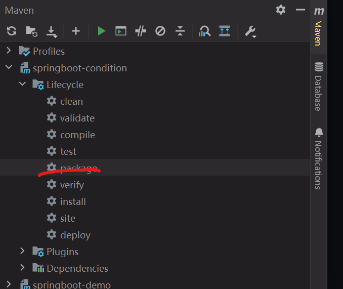
在target这边会有个jar包
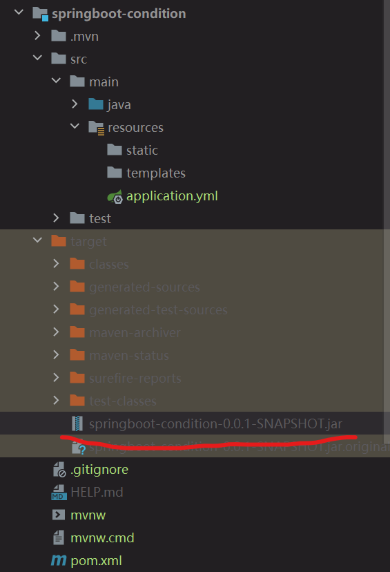
不过你要是嫌名字太上可以再pom文件中起别名

还是打开idea的maven这边先clean清理一下，再package打包

target这边生成的jar包就是你再pom文件中起的名字了


### war包方式
比较麻烦    
要在pom文件中添加
```xml
<packaging>war</packaging>
```
修改主启动类
```java
@SpringBootApplication
public class SpringbootConditionApplication extends SpringBootServletInitializer {

    public static void main(String[] args) {
        SpringApplication.run(SpringbootConditionApplication.class, args);
    }

    @Override
    protected SpringApplicationBuilder configure(SpringApplicationBuilder build) {
        return build;
    }

}
```
用上述的jar打包方式一样打包，在target中看到相应的war包
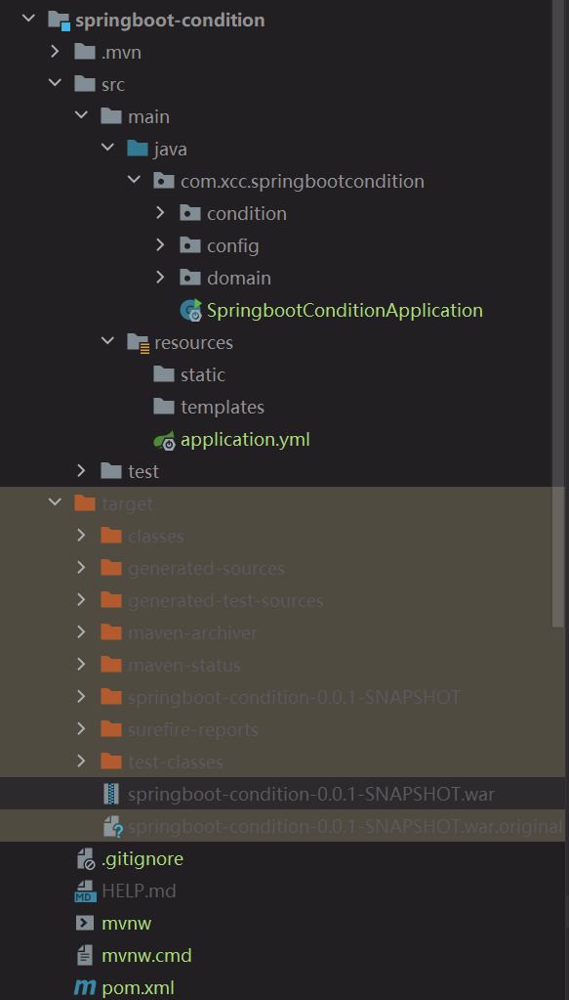

## 10、整合mybatis-plus

mybatis-plus可以理解为mybatis的升级版，就好比显卡：RTX3060 < RTX3060Ti, RTX3070 < RTX3070Ti

### 1、数据库信息

```mysql
CREATE TABLE `user` (
  `id` bigint NOT NULL,
  `name` varchar(255) DEFAULT NULL,
  `age` varchar(255) DEFAULT NULL,
  `email` varchar(255) DEFAULT NULL,
  PRIMARY KEY (`id`)
) ENGINE=InnoDB DEFAULT CHARSET=utf8mb3;
```

### 2、pom文件
添加相应的依赖    
```xml
        <dependency>
            <groupId>org.springframework.boot</groupId>
            <artifactId>spring-boot-starter-web</artifactId>
        </dependency>

        <dependency>
            <groupId>org.springframework.boot</groupId>
            <artifactId>spring-boot-starter-test</artifactId>
            <scope>test</scope>
        </dependency>

        <dependency>
            <groupId>mysql</groupId>
            <artifactId>mysql-connector-java</artifactId>
            <version>8.0.15</version>
        </dependency>

        <dependency>
            <groupId>com.baomidou</groupId>
            <artifactId>mybatis-plus-boot-starter</artifactId>
            <version>3.4.2</version>
        </dependency>

        <dependency>
            <groupId>org.projectlombok</groupId>
            <artifactId>lombok</artifactId>
        </dependency>
```
### 3、配置文件
application.yml文件
```yml

spring:
  datasource:
    driver-class-name: com.mysql.cj.jdbc.Driver
    url: jdbc:mysql://localhost:3306/mysql_test?useUnicode=true&characterEncoding=UTF-8&useSSL=false&serverTimezone=Asia/Shanghai
    username: 自己的账号
    password: 自己的密码

mybatis-plus:
  #  mapper-locations: classpath:mapper/*.xml
  mapper-locations: classpath:mapper/*.xml

```

### 4、基础类
entity
```java
@Data
@TableName("user")
public class UserInfo {
    @TableField("id")
    private Long Id;
    @TableField("name")
    private String names;
    @TableField("age")
    private Integer ageIng;
    @TableField("email")
    private String Email;
}

```

dao

```java
@Mapper
public interface UserInfoMapper extends BaseMapper<UserInfo> {
}

```

mapper

```java
<?xml version="1.0" encoding="UTF-8"?>
<!DOCTYPE mapper PUBLIC "-//mybatis.org//DTD Mapper 3.0//EN" "http://mybatis.org/dtd/mybatis-3-mapper.dtd">
<mapper namespace="com.xcc.springbootmybatisplus.dao.UserInfoMapper">

</mapper>
```

service

```java
public interface UserInfoService extends IService<UserInfo> {
}
```

impl

```java
@Service
public class UserInfoServiceImpl extends ServiceImpl<UserInfoMapper, UserInfo> implements UserInfoService {
}
```

### 5、测试

```java
@SpringBootTest
class SpringbootMybatisPlusApplicationTests {

    @Autowired
    private UserInfoService userInfoService;

    @Test
    void test() {
        UserInfo userInfo = userInfoService.getById(1);
        System.out.println(userInfo);
    }

}
```


### 6、Mybatis-X自动生成代码

idea需要安装Mybatis-X      
安装方式，打开idea ->  file  -> settings -> plugins;然后搜索myabtis，找到MyBatisX，Install
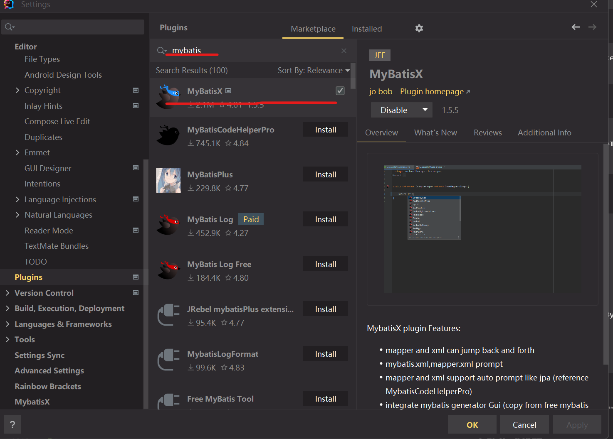

打开idea的Database，连接mysql，找到自己要生成代码的table


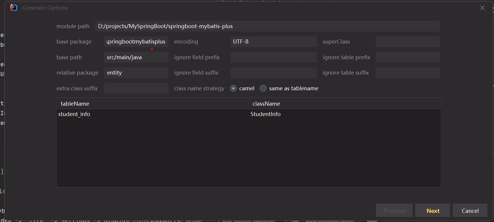
next下一步      
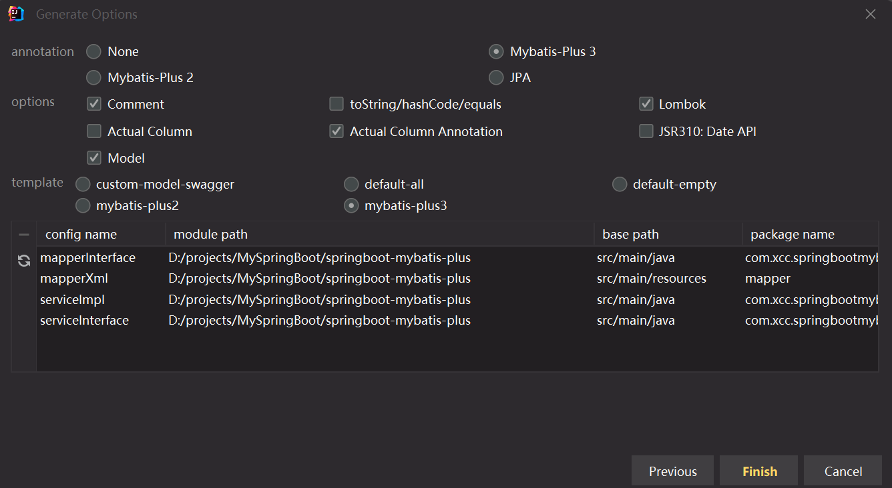
点击Finish完成，代码就生成好了。

> 注意：mybatis-plus和springboot的版本有冲突，springboot不要使用3.xx的版本

### 7、相关的增删改查

普通的查询

```java
@Test
    void contextLoads() {
        UserInfo u = userInfoMapper.selectById(1);
        System.out.println(u);
    }
```
基础查询的条件
QueryWrapper指定从查询条件
```
eq() 等于 =
ne() 不等于 <>
gt() 大于 >
ge() 大于等于 >=
lt() 小于 <
le() 小于等于 <=
between()  between 值1 and 值2
notbwtween() not between 值1 and 值2
in() in
notIn() not in
set() 修改中的set里面放要修改的内容
or() 或
```

条件查询方式1
```java
    @Test
    void selectTest() {
        QueryWrapper<UserInfo> queryWrapper = new QueryWrapper<>();
        queryWrapper.eq("name", "aaa")
                .gt("age", "2")
                .lt("age", "8");

        List<UserInfo> userInfos = userInfoMapper.selectList(queryWrapper);
        System.out.println(userInfos);
    }
```

条件查询方式2
```java
    @Test
    void selectTest2() {
        LambdaQueryWrapper<UserInfo> lambdaQueryWrapper = new LambdaQueryWrapper<>();
        lambdaQueryWrapper.eq(UserInfo::getNames, "aaa")
                .gt(UserInfo::getAgeIng, "2")
                .lt(UserInfo::getAgeIng, "8");

        List<UserInfo> userInfos = userInfoMapper.selectList(lambdaQueryWrapper);
        System.out.println(userInfos);
    }
```

模糊查询
```java
    @Test
    void selectTest3() {
        LambdaQueryWrapper<UserInfo> lambdaQueryWrapper = new LambdaQueryWrapper<>();
        lambdaQueryWrapper.eq(UserInfo::getNames, "aaa")
        .like(UserInfo::getEmail, "1")
        .gt(UserInfo::getAgeIng, "2")
        .lt(UserInfo::getAgeIng, "8");

        List<UserInfo> userInfos = userInfoMapper.selectList(lambdaQueryWrapper);
        System.out.println(userInfos);
    }
```

分页查询
```java
    @Test
    void PageTest() {
        Long current = 1L;
        Long size = 10L;
        LambdaQueryWrapper<UserInfo> lambdaQueryWrapper = new LambdaQueryWrapper<>();
        lambdaQueryWrapper.eq(UserInfo::getNames, "aaa")
        .gt(UserInfo::getAgeIng, "2")
        .lt(UserInfo::getAgeIng, "8");
        
        IPage<UserInfo> page = new Page<>(current, size);
        userInfoMapper.selectPage(page, lambdaQueryWrapper);

        List<UserInfo> records = page.getRecords();
        System.out.println(records);
        long total = page.getTotal();
        System.out.println(total);
        long pages = page.getPages();
        System.out.println(pages);
    }
```

添加
```java
    @Test
    void addTest() {
        UserInfo userInfo = new UserInfo();
        userInfo.setEmail("123");
        userInfo.setNames("aaa");
        userInfo.setAgeIng(1);

        for (int i = 0; i < 30; i++)
            userInfoMapper.insert(userInfo);
    }
```

修改方式1
```java
    @Test
    void updateTest1() {
            LambdaUpdateWrapper<UserInfo> lambdaUpdateWrapper = new LambdaUpdateWrapper<>();
        lambdaUpdateWrapper.eq(UserInfo::getNames, "aaa")
        .set(UserInfo::getAgeIng, "2")
        .set(UserInfo::getNames, "bbb");

        int i = userInfoMapper.update(null,lambdaUpdateWrapper);
        System.out.println(i);
}
```

修改方式2
```java
    @Test
    void updateTest2() {
        LambdaUpdateWrapper<UserInfo> lambdaUpdateWrapper = new LambdaUpdateWrapper<>();
        lambdaUpdateWrapper.eq(UserInfo::getNames, "aaa");

        UserInfo userInfo = new UserInfo();
        userInfo.setAgeIng(2);
        userInfo.setNames("bbb");
        int i = userInfoMapper.update(null,lambdaUpdateWrapper);
        System.out.println(i);
    }
```

根据主键删除
```java
   @Test
    void delete1() {
        int i = userInfoMapper.deleteById(1);
    }
```

根据条件删除
```java
    @Test
    void delete2() {
        LambdaQueryWrapper<UserInfo> lambdaQueryWrapper = new LambdaQueryWrapper<>();
        lambdaQueryWrapper.eq(UserInfo::getNames, "aaa");
        int i = userInfoMapper.delete(lambdaQueryWrapper);
    }
```

## 11、Redis

### 1、什么是NoSql

NoSql最常见的解释是"non-relational"，很多人也说它是"Not Only SQL"  
NoSQL仅仅是一个概念，泛指非关系的数据库  
区别于关系数据库，它们不保证关系数据的ACID特性  

### 2、Redis介绍

redis官网地址：[https://redis.io/](https://redis.io/)

中文网站：[http://www.redis.cn/](http://www.redis.cn/)

### 2.1、Redis的基本介绍

Redis是当前比较人们的NoSQL系统之一  
它是一个开源的、使用ANSI C语言编写的Key-value存储系统（区别于MySQL的二维表格形式存储）  

### 2.2、Redis的应用场景

1、取最新N个数据的操作  
2、排行榜应用，取TOP N操作  
3、需要精准设定过期时间的应用<br>
4、计数器应用<br>
5、Uniq操作，获取某段时间所有数据排重值<br>
6、实时系统，反垃圾系统<br>
7、缓存

### 2.3Redis的特点

高效性(内存)：Redis读取的速度是30w次/s，写的速度是10w次/s<br>
原子性(主逻辑线程是单线程)：Redis的所有操作都是原子性的，同时Redis还支持对几个操作全并后的原子性执行。<br>
支持多种数据结构：string（字符串），list（列表），hash（哈希），set（集合），zset（有序集合）<br>
稳定性：持久性，主从复制（集群）<br>
其他特性：支持过期时间，支持事务，消息订阅<br>

## 3、Redis单机环境安装

### 3.1、windows环境下安装

实现打开官网[https://redis.io/download/](https://redis.io/download/)
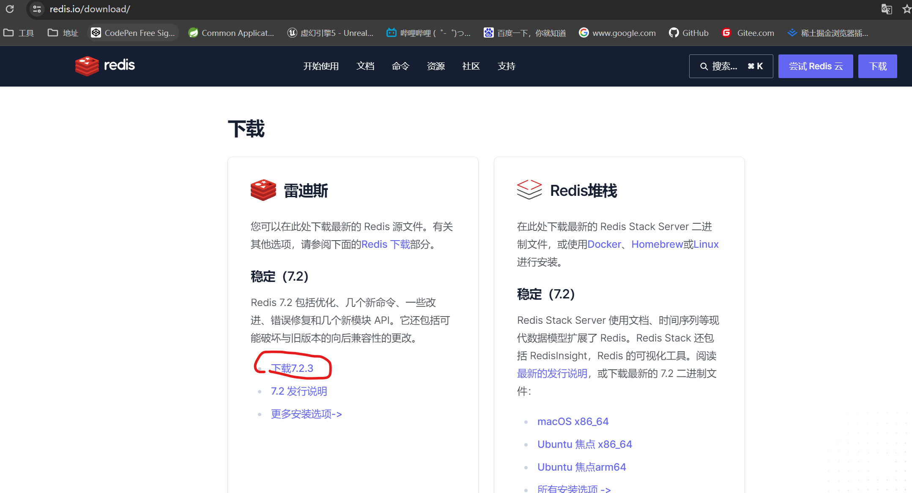
点击下载；下载完了在电脑上解压：
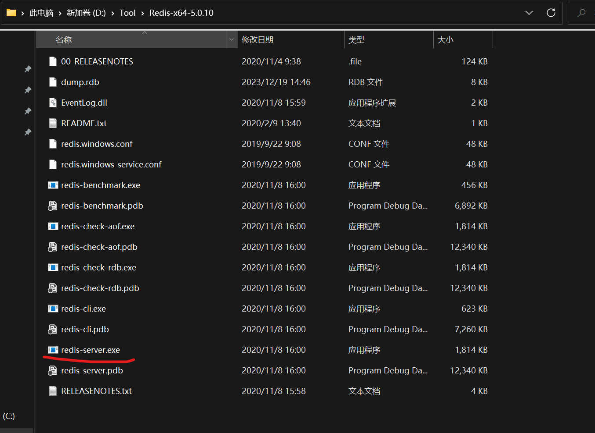
点击redis-server.exe；
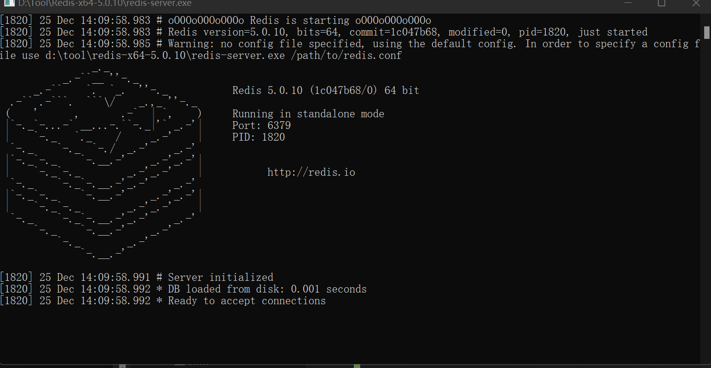
看到这个Windows上redis安装完成。

## 4、Redis的基本数据类型

### 4.1、Redis 字符串命令
下表列出了常用的 redis 字符串命令：

| 序号	                                        | 命令及描述                                                                                      |
|--------------------------------------------|--------------------------------------------------------------------------------------------|
| 1	                                         | SET key value 设置指定 key 的值。                                                                 |
| 2	                                         | GET key 获取指定 key 的值。                                                                       |
| 3	                                         | GETRANGE key start end 返回 key 中字符串值的子字符                                                    |
| 4	                                         | GETSET key value 将给定 key 的值设为 value ，并返回 key 的旧值(old value)。                               |
| 5	                                         | GETBIT key offset 对 key 所储存的字符串值，获取指定偏移量上的位(bit)。                                          |
| 6 | MGET key1 [key2..] 获取所有(一个或多个)给定 key 的值。                                                   |
| 7	                                         | SETBIT key offset value 对 key 所储存的字符串值，设置或清除指定偏移量上的位(bit)。                                 |
| 8	                                         | SETEX key seconds value 将值 value 关联到 key ，并将 key 的过期时间设为 seconds (以秒为单位)。                  |
| 9	                                         | SETNX key value  只有在 key 不存在时设置 key 的值。                                                    |
| 10	                                        | SETRANGE key offset value 用 value 参数覆写给定 key 所储存的字符串值，从偏移量 offset 开始。                      |
| 11	                                        | STRLEN key 返回 key 所储存的字符串值的长度。                                                             |
| 12	                                        | MSET key value [key value ...] 同时设置一个或多个 key-value 对。                                      |
| 13	                                        | MSETNX key value [key value ...] 同时设置一个或多个 key-value 对，当且仅当所有给定 key 都不存在。                  |
| 14	                                        | PSETEX key milliseconds value 这个命令和 SETEX 命令相似，但它以毫秒为单位设置 key 的生存时间，而不是像 SETEX 命令那样，以秒为单位。 |
| 15	                                        | INCR key 将 key 中储存的数字值增一。                                                                  |
| 16	                                        | INCRBY key increment 将 key 所储存的值加上给定的增量值（increment） 。                                      |
| 17	                                        | INCRBYFLOAT key increment 将 key 所储存的值加上给定的浮点增量值（increment） 。                               |
| 18	                                        | DECR key 将 key 中储存的数字值减一。                                                                  |
| 19	                                        | DECRBY key decrement key 所储存的值减去给定的减量值（decrement） 。                                        |
| 20                                         | APPEND key value 如果 key 已经存在并且是一个字符串， APPEND 命令将指定的 value 追加到该 key 原来值（value）的末尾。          |

实例：<br>
```
// 1 设置值  获取值
set loginName value
get loginName

// 2 mset mget 一次性操作多组数据
mset name1 value1 name2 value2 name3 value3
mget name1 name2 name3

// 3 没有这键我们才设置
setnx dlclass value

// 4 将key的值 加1
incr stock
decr stock

// 5 设置a值存活时间60秒，值是b  用于验证码
setex a 60 b
```

### 4.2、Redis hash 命令

Redis hash 是一个 string 类型的 field（字段） 和 value（值） 的映射表，hash 特别适合用于存储对象。

Redis 中每个 hash 可以存储 232 - 1 键值对（40多亿）。

下表列出了 redis hash 基本的相关命令：

|序号	|命令及描述|
|-------|--------|
|1	|HDEL key field1 [field2] 删除一个或多个哈希表字段|
|2	|HEXISTS key field 查看哈希表 key 中，指定的字段是否存在。|
|3	|HGET key field 获取存储在哈希表中指定字段的值。|
|4	|HGETALL key 获取在哈希表中指定 key 的所有字段和值|
|5	|HINCRBY key field increment 为哈希表 key 中的指定字段的整数值加上增量 increment 。|
|6	|HINCRBYFLOAT key field increment 为哈希表 key 中的指定字段的浮点数值加上增量 increment 。|
|7	|HKEYS key 获取哈希表中的所有字段|
|8	|HLEN key 获取哈希表中字段的数量|
|9	|HMGET key field1 [field2] 获取所有给定字段的值|
|10	|HMSET key field1 value1 [field2 value2 ] 同时将多个 field-value (域-值)对设置到哈希表 key 中。|
|11	|HSET key field value 将哈希表 key 中的字段 field 的值设为 value 。|
|12	|HSETNX key field value 只有在字段 field 不存在时，设置哈希表字段的值。|
|13	|HVALS key 获取哈希表中所有值。|
|14	|HSCAN key cursor [MATCH pattern] [COUNT count] 迭代哈希表中的键值对。|

实例：<br>
```
// 1 设置值  获取值
hset user username xcc
hset user age 26
hget user username

// 2 批量
hmset user1 username qwer age 27

// 3 获取所有的键值对
hgetall user

// 4 获取所有小key
hkeys user

// 5 获取所有值
HVALS user

// 6 删除
hdel user age
```

### 4.3、Redis 列表命令

Redis列表是简单的字符串列表，按照插入顺序排序。你可以添加一个元素到列表的头部（左边）或者尾部（右边）

一个列表最多可以包含 232 - 1 个元素 (4294967295, 每个列表超过40亿个元素)。

下表列出了列表相关的基本命令：

| 序号	 | 命令及描述                                                                                                |
|-----|------------------------------------------------------------------------------------------------------|
| 1	  | BLPOP key1 [key2 ] timeout 移出并获取列表的第一个元素， 如果列表没有元素会阻塞列表直到等待超时或发现可弹出元素为止。                             |
| 2	  | BRPOP key1 [key2 ] timeout 移出并获取列表的最后一个元素， 如果列表没有元素会阻塞列表直到等待超时或发现可弹出元素为止。                            |
| 3	  | BRPOPLPUSH source destination timeout 从列表中弹出一个值，将弹出的元素插入到另外一个列表中并返回它； 如果列表没有元素会阻塞列表直到等待超时或发现可弹出元素为止。 |
| 4	  | LINDEX key index 通过索引获取列表中的元素                                                                        |
| 5	  | LINSERT key BEFORE AFTER pivot value 在列表的元素前或者后插入元素                                                  |
| 6	  | LLEN key 获取列表长度                                                                                      |
| 7	  | LPOP key 移出并获取列表的第一个元素                                                                               |
| 8	  | LPUSH key value1 [value2] 将一个或多个值插入到列表头部                                                             |
| 9	  | LPUSHX key value 将一个值插入到已存在的列表头部                                                                     |
| 10	 | LRANGE key start stop 获取列表指定范围内的元素                                                                   |
| 11	 | LREM key count value 移除列表元素                                                                          |
| 12	 | LSET key index value 通过索引设置列表元素的值                                                                    |
| 13	 | LTRIM key start stop 对一个列表进行修剪(trim)，就是说，让列表只保留指定区间内的元素，不在指定区间之内的元素都将被删除。                            |
| 14	 | RPOP key 移除列表的最后一个元素，返回值为移除的元素。                                                                      |
| 15	 | RPOPLPUSH source destination 移除列表的最后一个元素，并将该元素添加到另一个列表并返回                                            |
| 16	 | RPUSH key value1 [value2] 在列表中添加一个或多个值到列表尾部                                                          |
|17	|RPUSHX key value 为已存在的列表添加值|

实例：<br>
```
// 1 设置值
lpush list1 1 2 3 4 1
rpush list1 6

// 2 查看数据
lrange list1 0 -1

// 3 移除数据
lpop list1
rpop list1
```

### 4.4、Redis 集合命令

Redis 的 Set 是 String 类型的无序集合。集合成员是唯一的，这就意味着集合中不能出现重复的数据。

集合对象的编码可以是 intset 或者 hashtable。

Redis 中集合是通过哈希表实现的，所以添加，删除，查找的复杂度都是 O(1)。

集合中最大的成员数为 232 - 1 (4294967295, 每个集合可存储40多亿个成员)。

下表列出了 Redis 集合基本命令：

| 序号	 | 命令及描述                                                                    |
|-----|--------------------------------------------------------------------------|
| 1	  | SADD key member1 [member2] 向集合添加一个或多个成员                                  |
| 2	  | SCARD key 获取集合的成员数                                                       |
| 3	  | SDIFF key1 [key2] 返回第一个集合与其他集合之间的差异。                                     |
| 4	  | SDIFFSTORE destination key1 [key2] 返回给定所有集合的差集并存储在 destination 中         |
| 5	  | SINTER key1 [key2] 返回给定所有集合的交集                                           |
| 6	  | SINTERSTORE destination key1 [key2] 返回给定所有集合的交集并存储在 destination 中        |
| 7	  | SISMEMBER key member 判断 member 元素是否是集合 key 的成员                           |
| 8	  | SMEMBERS key 返回集合中的所有成员                                                  |
| 9	  | SMOVE source destination member 将 member 元素从 source 集合移动到 destination 集合 |
| 10	 | SPOP key 移除并返回集合中的一个随机元素                                                 |
| 11	 | SRANDMEMBER key [count] 返回集合中一个或多个随机数                                    |
| 12	 | SREM key member1 [member2] 移除集合中一个或多个成员                                  |
| 13	 | SUNION key1 [key2] 返回所有给定集合的并集                                           |
|14	| SUNIONSTORE destination key1 [key2] 所有给定集合的并集存储在 destination 集合中         |
|15	| SSCAN key cursor [MATCH pattern] [COUNT count] 迭代集合中的元素                  |

实例：<br>
```
// 1 添加数据
sadd set1 1 2 3 4 5

// 2 获取数据
smembers set1

// 3 获取成员数量
scard set1

// 4 业务 uv 当天登录用户数
sadd uv:20231225 001 002 003 002
```

### 4.5、Redis keys 命令
下表给出了与 Redis 键相关的基本命令：

| 序号	 | 命令及描述                                                                                                              |
|-----|--------------------------------------------------------------------------------------------------------------------|
| 1	  | DEL key 该命令用于在 key 存在时删除 key。                                                                                      |
| 2	  | DUMP key 序列化给定 key ，并返回被序列化的值。                                                                                     |
| 3	  | EXISTS key 检查给定 key 是否存在。                                                                                          |
| 4	  | EXPIRE key seconds 为给定 key 设置过期时间，以秒计。                                                                             |
| 5	  | EXPIREAT key timestamp EXPIREAT 的作用和 EXPIRE 类似，都用于为 key 设置过期时间。 不同在于 EXPIREAT 命令接受的时间参数是 UNIX 时间戳(unix timestamp)。 |
| 6	  | PEXPIRE key milliseconds 设置 key 的过期时间以毫秒计。                                                                         |
| 7	  | PEXPIREAT key milliseconds-timestamp 设置 key 过期时间的时间戳(unix timestamp) 以毫秒计                                          |
| 8	  | KEYS pattern 查找所有符合给定模式( pattern)的 key 。                                                                           |
| 9	  | MOVE key db 将当前数据库的 key 移动到给定的数据库 db 当中。                                                                           |
| 10	 | PERSIST key 移除 key 的过期时间，key 将持久保持。                                                                                |
| 11	 | PTTL key 以毫秒为单位返回 key 的剩余的过期时间。                                                                                    |
| 12	 | TTL key 以秒为单位，返回给定 key 的剩余生存时间(TTL, time to live)。                                                                 |
| 13	 | RANDOMKEY 从当前数据库中随机返回一个 key 。                                                                                      |
| 14	 | RENAME key newkey 修改 key 的名称                                                                                       |
| 15	 | RENAMENX key newkey 仅当 newkey 不存在时，将 key 改名为 newkey 。                                                              |
| 16	 | SCAN cursor [MATCH pattern] [COUNT count] 迭代数据库中的数据库键。                                                             |
|17	|TYPE key 返回 key 所储存的值的类型。|

实例：<br>
```
// 1 删除
del user1

// 2 查看所有的key
keys *    // 生产环境下，别用

// 3 存在key
exists user1

// 4 存活时间
expire ydlclass 5

// 5 剩余存活时间    用于登录续期
pttl user1

// 6 随机获取key
randomkey
```

### 4.6、Redis 有序集合命令

Redis 有序集合和集合一样也是 string 类型元素的集合,且不允许重复的成员。

不同的是每个元素都会关联一个 double 类型的分数。redis 正是通过分数来为集合中的成员进行从小到大的排序。

有序集合的成员是唯一的,但分数(score)却可以重复。

集合是通过哈希表实现的，所以添加，删除，查找的复杂度都是 O(1)。 集合中最大的成员数为 232 - 1 (4294967295, 每个集合可存储40多亿个成员)。

用于统计top，B站的top，微博的top等等

下表列出了 redis 有序集合的基本命令:

| 序号	 | 命令及描述                                                                                      |
|-----|--------------------------------------------------------------------------------------------|
| 1	  | ZADD key score1 member1 [score2 member2] 向有序集合添加一个或多个成员，或者更新已存在成员的分数                       |
| 2	  | ZCARD key 获取有序集合的成员数                                                                       |
| 3	  | ZCOUNT key min max 计算在有序集合中指定区间分数的成员数                                                      |
| 4	  | ZINCRBY key increment member 有序集合中对指定成员的分数加上增量 increment                                   |
| 5	  | ZINTERSTORE destination numkeys key [key ...] 计算给定的一个或多个有序集的交集并将结果集存储在新的有序集合 destination 中 |
| 6	  | ZLEXCOUNT key min max 在有序集合中计算指定字典区间内成员数量                                                  |
| 7	  | ZRANGE key start stop [WITHSCORES] 通过索引区间返回有序集合指定区间内的成员                                    |
| 8	  | ZRANGEBYLEX key min max [LIMIT offset count] 通过字典区间返回有序集合的成员                               |
| 9	  | ZRANGEBYSCORE key min max [WITHSCORES] [LIMIT] 通过分数返回有序集合指定区间内的成员                          |
| 10	 | ZRANK key member 返回有序集合中指定成员的索引                                                            |
| 11	 | ZREM key member [member ...] 移除有序集合中的一个或多个成员                                               |
| 12	 | ZREMRANGEBYLEX key min max 移除有序集合中给定的字典区间的所有成员                                             |
| 13	 | ZREMRANGEBYRANK key start stop 移除有序集合中给定的排名区间的所有成员                                         |
| 14	 | ZREMRANGEBYSCORE key min max 移除有序集合中给定的分数区间的所有成员                                           |
| 15	 | ZREVRANGE key start stop [WITHSCORES] 返回有序集中指定区间内的成员，通过索引，分数从高到低                           |
| 16	 | ZREVRANGEBYSCORE key max min [WITHSCORES] 返回有序集中指定分数区间内的成员，分数从高到低排序                        |
| 17	 | ZREVRANK key member 返回有序集合中指定成员的排名，有序集成员按分数值递减(从大到小)排序                                     |
| 18	 | ZSCORE key member 返回有序集中，成员的分数值                                                            |
| 19	 | ZUNIONSTORE destination numkeys key [key ...] 计算给定的一个或多个有序集的并集，并存储在新的 key 中                |
| 20	 | ZSCAN key cursor [MATCH pattern] [COUNT count] 迭代有序集合中的元素（包括元素成员和元素分值）                     |

实例：<br>
```
// 1 添加
zadd pv 100 page1.html 200 page2.html 300 page3.thml

// 2 查看
zcard pv

// 3 查看指定权重范围的成员数
ZCOUNT pv 150 500

// 4 添加权重
ZINCRBY pv 1 page1.html

// 5 交集
ZADD pv_zset1 10 page1.html 20 page2.html
ZADD pv_zset2 5 page1.html 10 page2.html

// 6 成员的分数值
ZSCORE pv_zset page3.html

// 7 获取下标范围内的成员。  排序，默认权重由低到高
ZRANGE pv 0 -1

// 8 获取由高到低的几个成员（reverse）使用最多的
效率很高，因为本身zset就是排好序的。
ZREVRANGE key start stop
```

### 4.7、对位图BitMaps的操作

计算机最小的存储单位是bit，Bitmaps是针对位的操作的，相较于String、Hash、Set等存储方式更加节省空间<br>
Bitmaps不是一种数据结构，操作是基于String结构的，一个String最大可以存储512M，那么一个Bitmaps则可以设置2^32个位<br>
Bitmaps单独提供了一套命令，所有在Redis中使用Bitmaps和使用字符串的方法不太相同。<br>
可以把Bitmaps想象成一个以位为单位的数组，数组的每个单元只能存储0和1，数组的下标在Bitmaps中叫做偏移量offset<br>
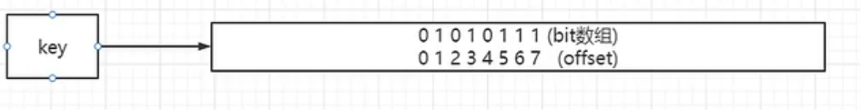
BitMaps命令说明：**将每个独立用户是否访问过网站存放在Bitmaps中，将访问的用户记做1，没有访问的用户记做0，用偏移量作为用户的id**。

```
// 设置值
setbit key offset value

// 获取值
getbit key offset

// 获取bitmaps指定范围值为1的个数
bitcount key [start end]

// bitmaps间的运算
bitop operation destkey key [key, ...]
```

### 4.8、Redis HyperLogLog 命令

Redis HyperLogLog 是用来做基数统计的算法，HyperLogLog 的优点是，在输入元素的数量或者体积非常大的时候，计算基数所需的空间总是固定的、而且是很少的。

在 Redis 里面，每个 HyperLogLog 键只需要占用 12 KB 内存，就可以计算接近 2^64 个不同元素的基本数据。这和计算基本数据时，元素越多内存位置的集合就形成了对比。

但是，因为 HyperLogLog 只是根据输入元素来计算基数，而不会存储输入元素本身，所以 HyperLogLog 不能像集合那样，返回输入的各个元素。

以下推出了redis HyperLogLog 的基本命令：

|序号	|命令及描述|
|-------|--------|
|1	|PFADD key element [element ...] 添加指定元素到 HyperLogLog 中。|
|2	|PFCOUNT key [key ...] 返回给定 HyperLogLog 的基数提示值。|
|3	|PFMERGE destkey sourcekey [sourcekey ...] 将多个 HyperLogLog 合并为一个 HyperLogLog|

### 5、Java操作redis

### 1、创建一个maven工程
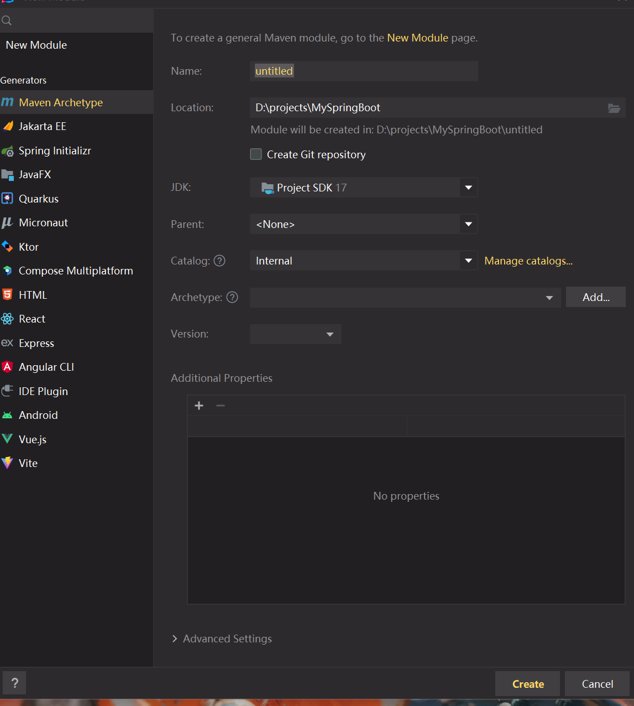

### 2、pom文件修改

```xml
<project xmlns="http://maven.apache.org/POM/4.0.0" xmlns:xsi="http://www.w3.org/2001/XMLSchema-instance"
  xsi:schemaLocation="http://maven.apache.org/POM/4.0.0 http://maven.apache.org/maven-v4_0_0.xsd">
  <modelVersion>4.0.0</modelVersion>
  <groupId>com.xcc</groupId>
  <artifactId>redis-and-java</artifactId>
  <version>1.0-SNAPSHOT</version>

  <properties>
    <maven.compiler.source>8</maven.compiler.source>
    <maven.compiler.target>8</maven.compiler.target>
  </properties>

  <dependencies>
    <dependency>
      <groupId>redis.clients</groupId>
      <artifactId>jedis</artifactId>
      <version>2.9.0</version>
    </dependency>

    <dependency>
      <groupId>junit</groupId>
      <artifactId>junit</artifactId>
      <version>4.12</version>
      <scope>test</scope>
    </dependency>
    <dependency>
      <groupId>org.testng</groupId>
      <artifactId>testng</artifactId>
      <version>7.4.0</version>
      <scope>test</scope>
    </dependency>
  </dependencies>

  <build>
    <plugins>
      <plugin>
        <groupId>org.springframework.boot</groupId>
        <artifactId>spring-boot-maven-plugin</artifactId>
      </plugin>
    </plugins>
  </build>

</project>
```

### 3、写测试类

创建测试类ApiTest

```java
package com.xcc.redis;

import org.testng.annotations.AfterTest;
import org.testng.annotations.BeforeTest;
import org.testng.annotations.Test;
import redis.clients.jedis.Jedis;
import redis.clients.jedis.JedisPool;
import redis.clients.jedis.JedisPoolConfig;

/**
 * @Author GamePlayer-Joker
 * @Date 2023/12/26
 */
public class ApiTest {
    
    JedisPool jedisPool;
    
    // BeforeTest 这个注解是在Test启动前启动的，这里用于创建连接
    // 注意这里要小心要用testing的import
    @BeforeTest
    public void beforeTest() {
        // 创建jedis连接池
        JedisPoolConfig config = new JedisPoolConfig();
        // 最大空闲连接
        config.setMaxIdle(10);
        // 最小空闲连接
        config.setMinIdle(5);
        // 最大空闲时间 这里设置的4秒
        config.setMaxWaitMillis(4000);
        // 最大连接数
        config.setMaxTotal(50);

        // 这里连接的是本地的redis，默认端口号是6379
        jedisPool = new JedisPool(config, "127.0.0.1", 6379);
    }

    // 测试前要启动本地的redis
    @Test
    public void testString() {
        // 从池子中拿一个连接
        Jedis jedis = jedisPool.getResource();
        String name = jedis.get("myname");
        System.out.println("name====="+name);
    }
    
    // AfterTest注解是Test执行完之后执行的，这里用于断开连接
    // 注意要用testing的import
    @AfterTest
    public void closeTest() {
        jedisPool.close();
    }

}
```

### 4、 reids各类型数据的操作

string相关操作：

```java
    // redis string相关的实例：
    @Test
    public void testString() {
        // 从池子中拿一个连接
        Jedis jedis = jedisPool.getResource();

        // 1. 添加一个string类型的数据，key为pv，用于保持pv的值，初始值为0
        String pv = jedis.set("pv", "0");

        // 2. 查询该key对应的数据
        String pv1 = jedis.get("pv");
        System.out.println("pv1=="+pv1);

        // 3. 修改pv为1000
        jedis.set("pv", "1000");
        pv1 = jedis.get("pv");
        System.out.println("pv1=="+pv1);

        // 4. 实现整形数据原子自增操作 +1
        Long pv2 = jedis.incr("pv");
        System.out.println("pv2=="+pv2);

        // 5. 实现整形该数据原子自增操作 + 1000
        Long pv3 = jedis.incrBy("pv", 1000);
        System.out.println("pv3=="+pv3);
    }
```
结果：
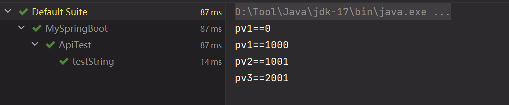

Hash相关操作：
```java
// redis hash相关操作实例
    @Test
    public void testHash() {
        // 从池子中拿一个连接
        Jedis jedis = jedisPool.getResource();

        // 1. 往Hash结构中添加以下商品库存 goods
        // a) xiaomi14Pro -> 10000
        // b） mate60Pro  -> 9000
        jedis.hset("goods", "xiaomi14Pro", "10000");
        jedis.hset("goods", "mate60Pro", "9000");

        // 2. 获取Hash中所有的商品
        Set<String> goods = jedis.hkeys("goods");
        for (String good : goods) {
            System.out.println(good);
        }

        // 3. 新增3000个mate60Pro库存
        // 有两种方法可以实现:
        // 第一种方法,先从redis中拿到mate60Pro的数量，然后将数值修改，再放回去。
        // 逻辑没问题不过一般不这样操作，因为在高并发情况下会出问题
        // String hget = jedis.hget("goods", "mate60Pro");
        // int stock = Integer.parseInt(hget) + 3000;
        // jedis.hset("goods", "mate60Pro", stock+"");

        // 一般是直接用原子操作
        jedis.hincrBy("goods", "mate60Pro", 3000);

        String hget = jedis.hget("goods", "mate60Pro");
        System.out.println("hget=="+hget);

        // 4. 删除整个Hash的数据
        jedis.del("goods");
    }
```
结果：


List相关操作：
```java
 // redis list相关操作实例：
    @Test
    public void testList() {
        // 从池子中拿一个连接
        Jedis jedis = jedisPool.getResource();

        // 1. 向list的左边插入以下三个手机号码：18511310002，18912301233，18123123314
        jedis.lpush("phoneNumber", "18511310002", "18912301233", "18123123314");

        // 2. 从右边移除一个手机号码
        String phoneNumber = jedis.rpop("phoneNumber");
        System.out.println("phoneNumber=="+phoneNumber);

        // 3. 获取list所有的值
        List<String> phoneNumber1 = jedis.lrange("phoneNumber", 0, -1);
        for (String s : phoneNumber1) {
            System.out.println(s);
        }

        // 关掉jedis
        jedis.close();
    }
```
结果：
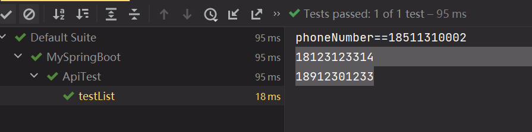

Set相关操作：
```java
    // redis set相关操作实例：
    @Test
    public void testSet() {
        // 从池子中拿一个连接
        Jedis jedis = jedisPool.getResource();

        // 使用set来保持uv值，为了方便计算，将用户名保存到uv中。
        // 1. 往一个set中提娜佳页面page1的uv，用户user1访问一次该页面
        jedis.sadd("uv", "user1");

        // 2. user2访问一次该页面
        jedis.sadd("uv", "user2");

        // 3. user1再访问一次该页面
        jedis.sadd("uv", "user1");

        // 4. 最后获取 page1的uv值
        Long uv = jedis.scard("uv");
        System.out.println("uv=="+uv);

        // 关掉jedis
        jedis.close();
    }
```
结果：
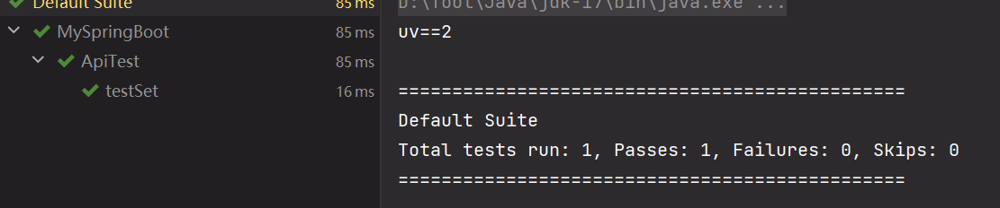

## 6、redis高级

### Redis的持久化

> 由于redis是一个内存数据库，所有的数据都是保存再内存当中的，内存当中的数据极易丢失，所有redis的数据持久化
> 就显得尤为重要，再redis当中，提供了两种数据持久化的方式，分别为RDB以及AOF，且Redis默认开启的数据持久化方式是
> RDB方式。

RDB：
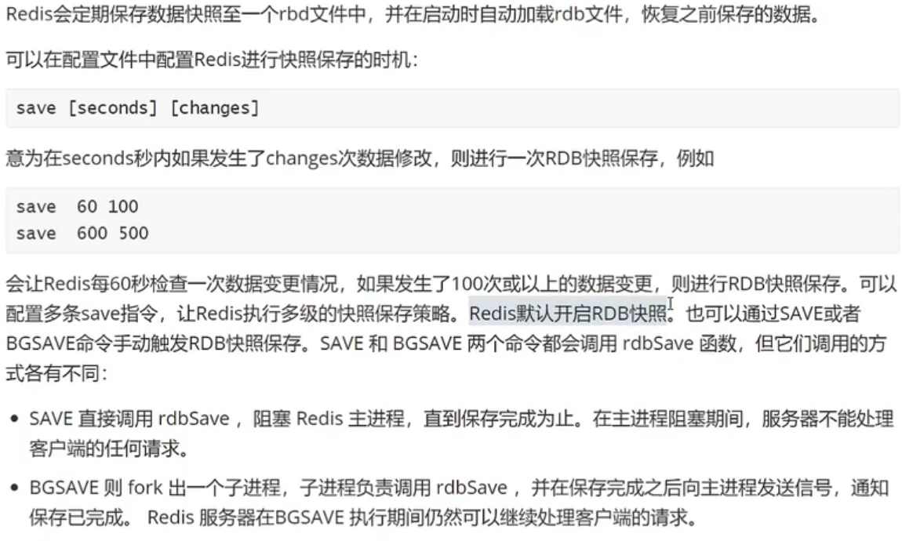

RDB的优点：
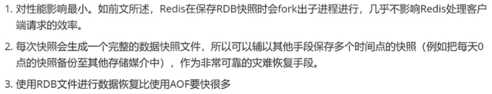

RDB的缺点：


修改redis的配置文件：<br>
```
cd /export/server/redis-6.2.6/
vim redis.conf
# 第 行
save 900 1
save 300 10
save 60 10000
save 5 1
```

重新启动redis服务<br>
每次生成新的dump.rdb都会覆盖掉之前的老的快照<br>
```
ps -ef | grep redis
bin/redis-cli -h ip地址 shutdown
bin/redis-server redis.conf
```

AOF：<br>
采用AOF持久方式时，Redis会把每一个写请求都记录在一个日志文件里。在Redis重启时，
会把AOF文件中记录的所有写操作顺序执行一边，确保数据恢复到最新。

开启AOF<br>
AOF是默认关闭的，如果要开启，进行如下配置：<br>
```
# 第594行
appendonly yes
```

配置AOF：<br>
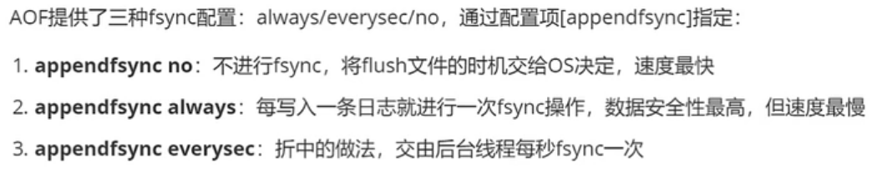

AOF rewrite
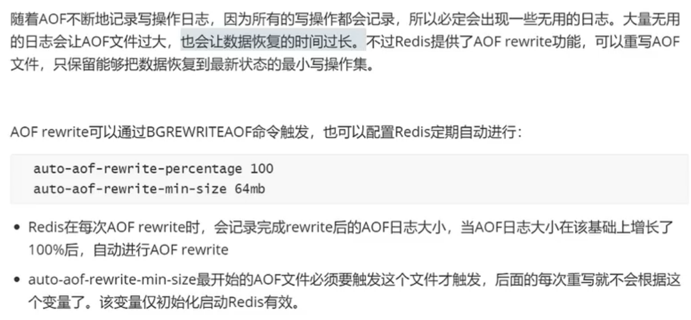

AOF 优点
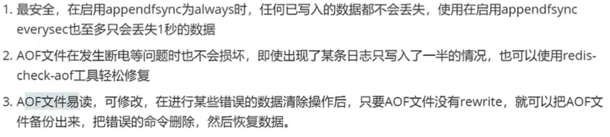

AOF 缺点
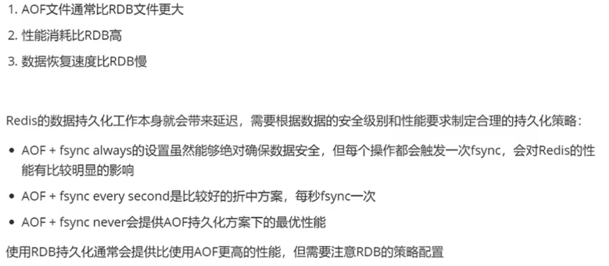

RDB和AOF对比
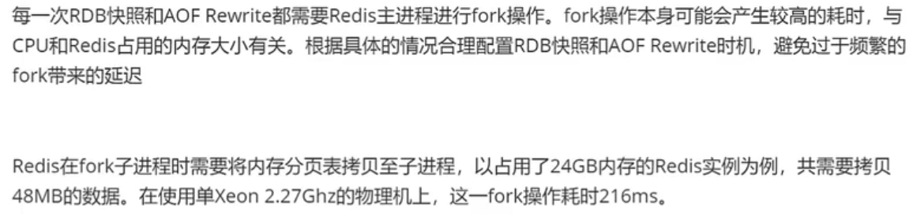

### Redis的事务

> Redis事务的本质是一组命令的集合。事务支持一次执行多个命令，一个事务中所有命令都会被序列化。
> 在事务执行过程，会按顺序串行化执行队列的命令，其他客户端提交的命令请求不会插入到事务执行命令序列中。
> 总结：Redis事务就是一次性、顺序性、排他性的执行一个队列中的一系列命令

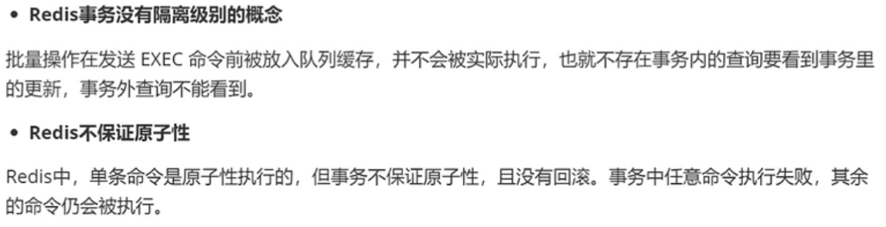

一个事务从开始到执行会经历以下三个阶段：<br
1、开始事务<br>
2、命令入队<br>
3、执行事务<br>

Redis事务相关命令：<br>
```
MULTI
开启事务，redis会将后续的命令逐个放入队列中，然后使用EXEC命令来原子化执行这个命令队列

EXEC
执行事务中的所有操作命令

DISCARD
取消事务，放弃执行事务块中的所有命令

WATCH
监视一个或多个key，如果事务在执行前，这个key（或多个key）被其他命令修改，则事务被中断，不会执行事务中的任何命令

UNWATCH
取消WATCH对所有key的监视
```

事务的实例：<br>
MULTI开始一个事务：给k1，k2分别赋值，在事务中修改k1，k2执行事务后，查看k1，k2值都被修改。
```
set key1 v1

set key2 v2

multi

set key1 11

set key2 22

exec

get key1

get key2
```

取消事务
```
multi

set key1 v1

set key2 v2

discard

get key1

get key2
```

为什么Redis不支持事务回滚


### 数据删除与淘汰策略

Redis中的数据特征：
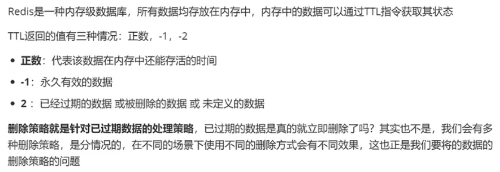

数据的时效在redis的存储如下图：
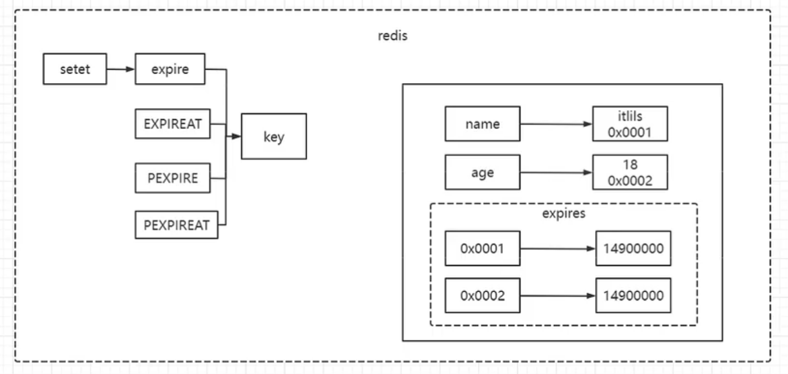

过期数据是一块独立的存储空间，Hash结构，field是内存地址，value是过期时间，保存了所有key的过期描述，在最终进行过期处理的时候<br>
对该空间的数据进行检测，当时间到期之后通过field找到内存该地址处的数据，然后进行相关操作。

数据删除策略<br>
数据删除策略的目标：<br>
在内容占用与CPU占用之间寻找一种平很，顾此都会造成整体redis性能的下降，引发服务器宕机或内存泄漏<br>

主要删除策略有：<br>
1. 定时删除<br>
2. 惰性删除<br>
3. 定期删除<br>

定时删除:

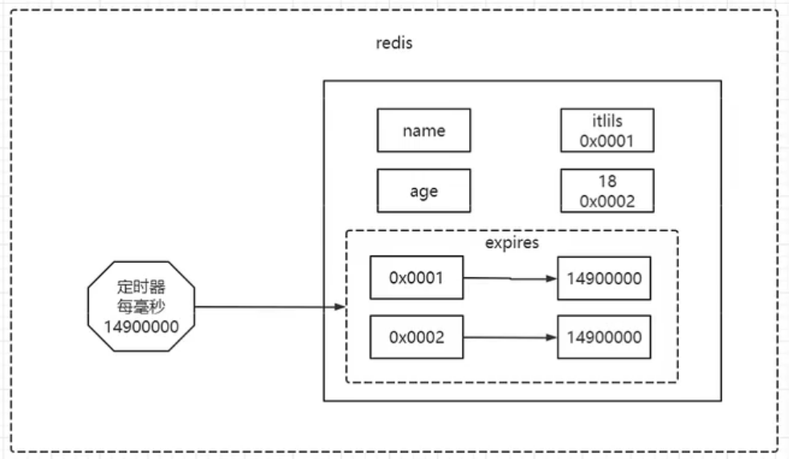
惰性删除:
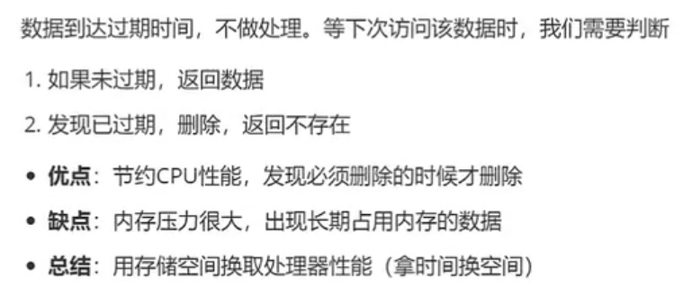
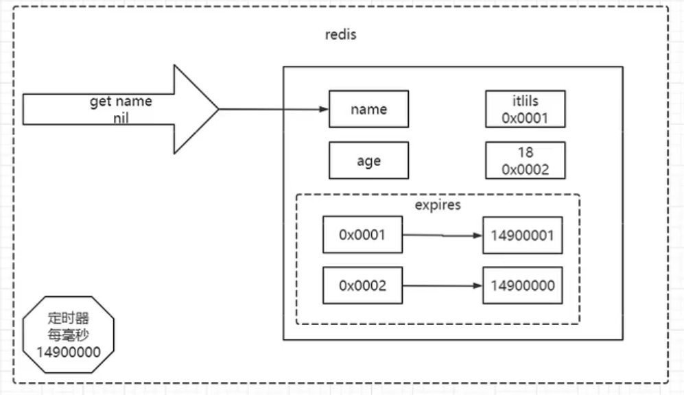

定期删除:
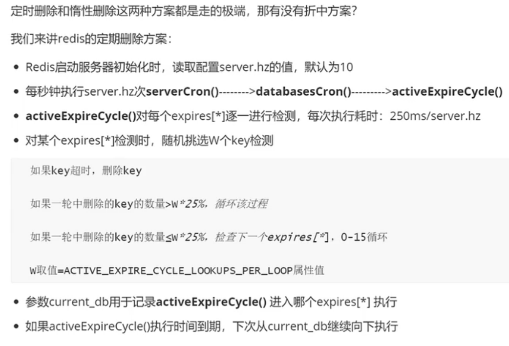
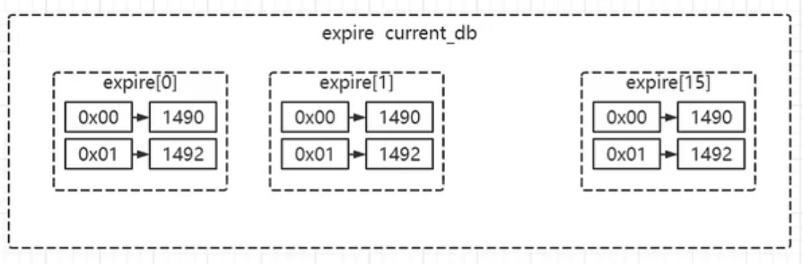
总的来说：定期删除就是周期性轮询redis库中的时效性数据，采用随机抽取的策略，利用过期数据占比的方式控制删除频度。
> 特点1：CPU性能占用设置有峰值，检测频度可自定义设置<br>
> 特点2：内存压力不是很大，长期占用内存的冷数据会被持续清理<br>
> 总结：周期性抽查存储空间（随机抽查，重点抽查）

删除策略对比：

1：定时删除：
> 节省内存，不占用，<br>
> 不分时段占用CPU资源，频度高，<br>
> 拿时间换空间<br>

2：惰性删除：
> 内存占用严重<br>
> 延时执行，CPU利用率高<br>
> 拿空间换时间<br>

3：定期删除：
> 内存定期随机清理<br>
> 每秒花费固定的CPU资源维护内存<br>
> 随机抽取，重点抽取<br>

数据淘汰策略（逐出算法）<br>


策略配置：


数据删除的策略policy一共是3类8种：

**第一类**：检测易失数据（可能会过期的数据集server.db[i].expirs） 同一个库
> volatile-lru: 挑选最近最少使用的数据淘汰<br>
> 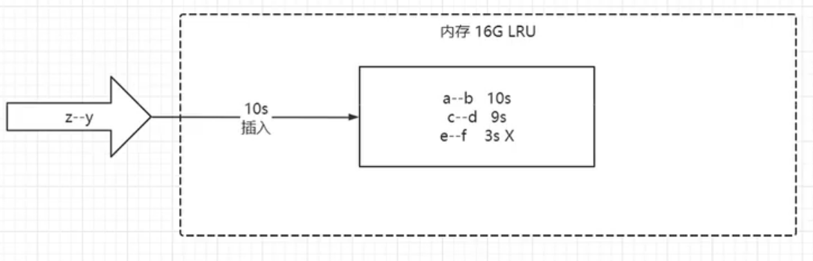
> volatile-lfu: 挑选最近使用次数最少的数据淘汰<br>
> 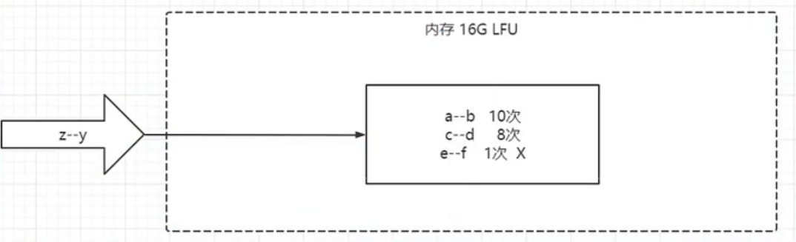
> volatile-ttl: 挑选将要过期的数据淘汰<br>
> 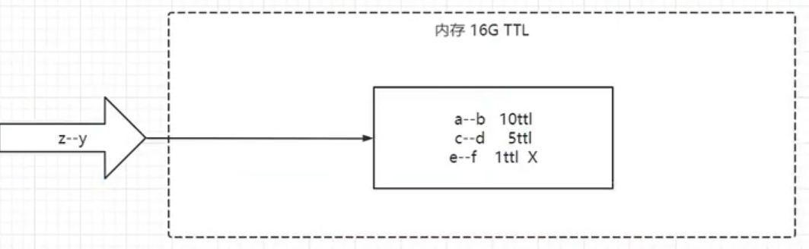
> volatile-random: 任意选择数据淘汰<br>
> 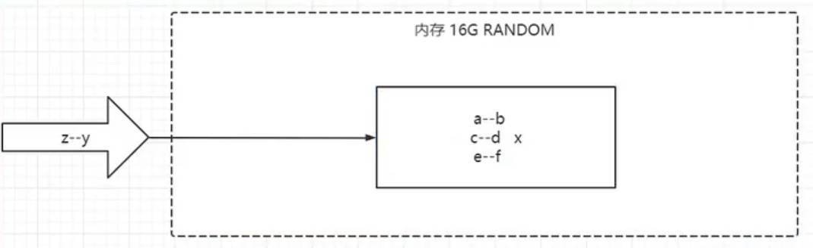

**第二类**: 检测全库数据（所有数据集server.db[i].dict）
> allkeys-lru: 挑选最近最少使用的数据淘汰<br>
> allkeLyRs-lfu: 挑选最近使用次数最少的数据淘汰<br>
> allkeys-random: 任意选择数据淘汰，相当于随机<br>

**第三类**: 放弃数据驱逐
> no-enviction(驱逐): 禁止驱逐数据（redis4.0中默认策略），会引发OOM(Out Of Memory)

配置方法：
> maxmemory-policy volatile-lru

**数据淘汰策略配置依据**

使用INFO命令输出监控信息，查询缓存hit和miss的次数，根据业务需求调优Redis配置。

### Redis的主从复制架构

**三高**：<br>
> **高并发**：应用提供某以业务要能支持客户端同时访问的能力，我们称为并发，高并发意思就很明确了<br>
> **高性能**：性能带给我们最直观的感受 就是：速度快，时间短<br>
> **高可用**：可用性：一年中应用服务正常运行的时间占全年时间的百分比。<br>
> 

**主从复制概念**


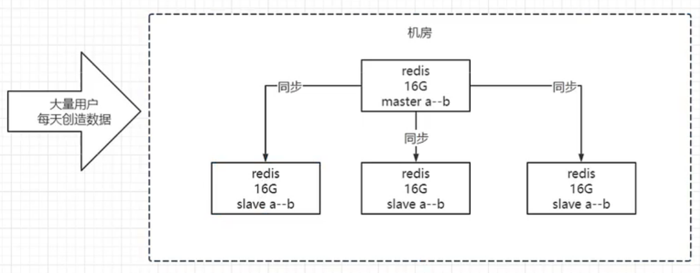

> 提供数据方： **master** <br>
> 主服务器，主节点，主库主客户端<br>
> 接收数据方：**slave**<br>
> 从服务器，从节点，从库<br>
> 从客户端<br>
> 需要解决的问题：<br>
> 数据同步（master的数据复制到slave中）

主从复制的概念：**主从复制即将master中的数据即时、有效的复制到slave中**<br>
**特征**：一个master可以拥有多个slave，一个slave只对应一个master<br>
**职责**：master和slave各自的职责不一样<br>

master:<br>
> 写数据<br>
> 执行写操作时，将出现变化的数据自动同步到**slave**<br>
> 读数据（可忽略）<br>

slave:<br>
> 读数据<br>
> 写数据（禁止）

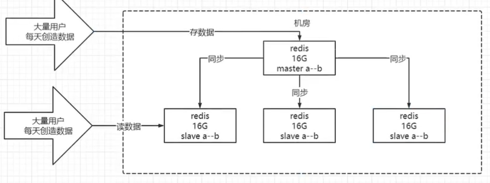

**主从复制的作用**

+ 读写分离：master写、slave读，提高服务器的读写负载能力
+ 负载均衡：基于主从结构，配合读写分离，由slave分担master负载，并根据需求的变化，改变slave的数量，通过多个节点分担数据读取负载，大大提高Redis服务器并发量与数据吞吐量
+ 故障恢复：当master出现问题时，由slave提供服务，实现快速的故障恢复
+ 数据冗余：实现数据热备份，是持久化之外的一种数据冗余方式
+ 高可用基石：基于主从复制，构建哨兵模式与集群，实现Redis的高可用方案


### Redis的Sentine架构


### Redis cluster集群架构


